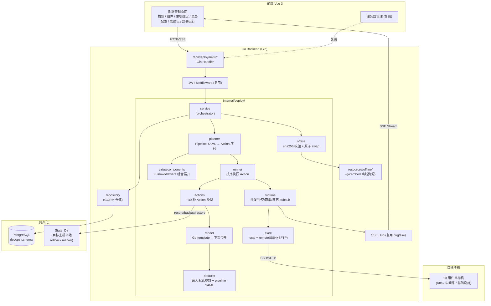
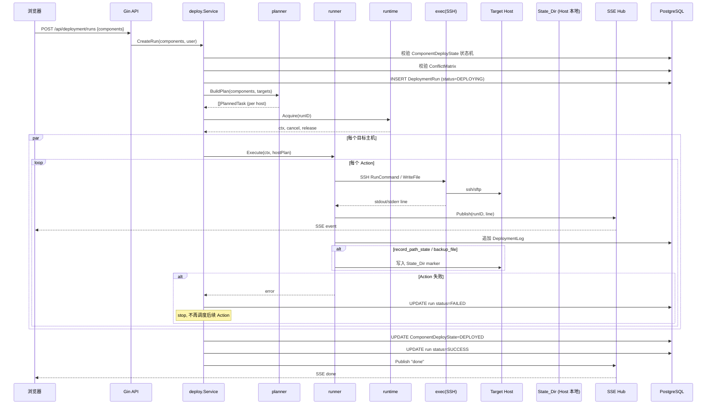
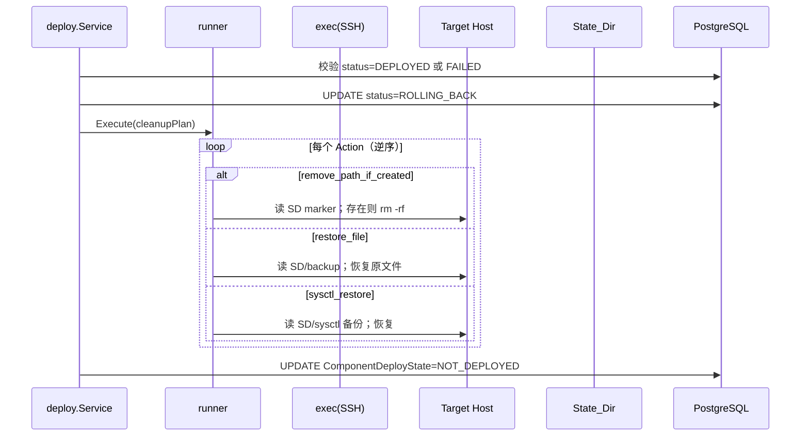
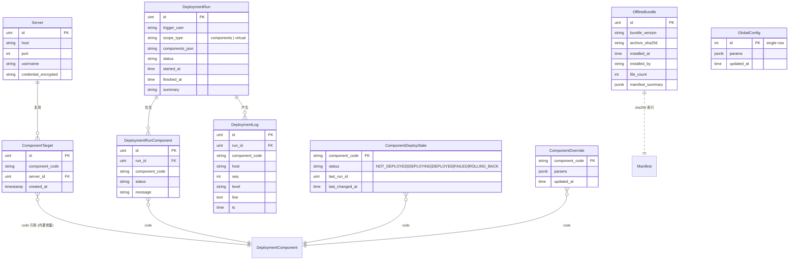

# Design Document: Deployment Management

## Overview

部署管理（Deployment Management）模块将原 `his-deploy` 项目的 HIS 基础设施离线部署能力整体迁入 `df-build-system`，作为现有"基础设施"占位模块的替代实现。模块在同一 Go 二进制内与构建发布子系统共存，承担 K8s 集群、中间件、基础服务共 23 个组件的离线部署、参数配置、状态管理与回滚。

核心设计目标：
1. **复用既有基础设施** — Gin、GORM、PostgreSQL、JWT、SSE、SSH/SFTP、Server 模型直接复用，不引入第二套技术栈。
2. **保留 his-deploy 的引擎语义** — planner/runner/runtime/exec/actions 行为保持 1:1 对齐，迁移工作集中在路径与存储层适配。
3. **清晰边界** — 所有部署管理代码集中在 `backend/internal/deploy/` 下，与构建子系统通过明确的接口（Server 仓储、SSE Hub）协作，不与 pipeline/k8s 包耦合。
4. **可逆性优先** — 状态机硬约束 + State_Dir 服务器本地 marker，保证 rollback 行为不依赖数据库可用性。

---

## Architecture

### 系统架构



### 部署运行时序



### 回滚时序（核心可逆性）



### 子系统边界

| 子系统 | 职责 | 与 deployment-management 的关系 |
|---|---|---|
| 构建发布（pipeline/k8s/registry） | 业务应用编译/制品/K8s 应用更新 | 不直接调用部署管理；保持独立 |
| 服务器管理（model.Server） | SSH 凭据与连接信息源 | **被复用**：部署目标通过 `server_id` 引用 Server |
| SSE Hub（pkg/sse） | 实时日志流 | **被复用**：部署运行日志走同一 Hub |
| JWT Middleware | 鉴权 | **被复用**：所有 `/api/deployment/*` 走同一鉴权 |
| WebSSH/SFTP（pkg/sftp + x/crypto/ssh） | 远端连接库 | **被复用**：exec 后端不引入新依赖 |

---

## Components and Interfaces

### Go 包结构

```
backend/internal/deploy/
├── service.go                  # 编排层：Run / Rollback / Preview / Cancel / List
├── planner/
│   ├── planner.go              # PipelineYAML → []PlannedTask
│   └── virtualcomponents.go    # k8s / middleware 虚拟组件展开
├── runner/
│   └── runner.go               # 顺序执行 Action，捕获日志，fail-stop
├── runtime/
│   ├── manager.go              # 并发槽位 + cancel 注册 + 冲突快照
│   └── pubsub.go               # 与 pkg/sse 适配（per-runID 频道）
├── exec/
│   ├── backend.go              # interface Backend { Run/WriteFile/... }
│   ├── local.go                # 本地执行（用于 controller-render 渲染）
│   └── remote.go               # SSH/SFTP，凭据从 Server 仓储取
├── actions/
│   ├── registry.go             # type → handler 注册表
│   ├── file.go                 # copy_file/copy_path/write_file/render_template/extract_archive/symlink/ensure_dir/chmod/chown
│   ├── system.go               # yum_package/rpm_package/systemd_service/system_user/system_group/sysctl_set/sysctl_restore/cron_line
│   ├── k8s.go                  # kubectl_apply/kubectl_delete/kubernetes_artifacts/kubernetes_artifacts_check
│   ├── check.go                # http_check/tcp_check/resource_preflight
│   ├── state.go                # record_path_state/backup_file/restore_file/remove_path*/assert_path_absent_if_created
│   ├── slb.go                  # slb_config
│   └── command.go              # run_command/fetch_file/copy_dir
├── render/
│   └── render.go               # Go template 渲染：defaults → global_config → override
├── offline/
│   └── offline.go              # sha256 校验 + manifest 反查 + 原子 swap
├── defaults/
│   ├── defaults.go             # //go:embed config/components/*.yml
│   └── pipelines.go            # //go:embed pipelines/*.yml
├── conflict/
│   └── matrix.go               # 主机绑定冲突矩阵（含 K8s vs 业务硬规则）
├── statedir/
│   └── statedir.go             # marker 路径约定与读写
├── handler/
│   ├── runs.go                 # POST /runs, /preview, /cancel, GET /runs/{id}/...
│   ├── targets.go              # GET/PUT /targets/{component}, POST /host-checks
│   ├── globalconfig.go         # GET/PUT /global-config
│   ├── overrides.go            # GET/PUT/DELETE /overrides/{component}
│   ├── offline.go              # /offline/upload, /install, /status
│   ├── components.go           # GET /components, /components/{name}
│   ├── enabled.go              # GET/PUT /components/enabled
│   └── stream.go               # GET /runs/{id}/events (SSE)
└── repository/
    ├── run.go                  # DeploymentRun + DeploymentLog
    ├── state.go                # ComponentDeployState
    ├── target.go               # ComponentTarget
    ├── override.go             # ComponentOverride
    ├── globalconfig.go         # GlobalConfig (single row)
    └── offline.go              # OfflineBundle metadata

backend/internal/deploy/resources/
├── offline/        # go:embed 23 组件离线资源
└── manifest.yml    # sha256 + bundle_version
```

### 关键接口

```go
// service.go
type Service interface {
    CreateRun(ctx context.Context, in CreateRunInput) (*DeploymentRun, error)
    Preview(ctx context.Context, in CreateRunInput) (*RunPlan, error)
    Cancel(ctx context.Context, runID uint) error
    Rollback(ctx context.Context, in RollbackInput) (*DeploymentRun, error)
    GetRun(ctx context.Context, runID uint) (*DeploymentRun, error)
    ListRuns(ctx context.Context, page, size int) (*RunPage, error)
    StreamLogs(ctx context.Context, runID uint) (<-chan sse.Event, func(), error)
}

// exec/backend.go
type Backend interface {
    Run(opts RunOptions, name string, args ...string) Result
    WriteFile(path string, data []byte, perm os.FileMode) error
    ReadFile(path string) ([]byte, error)
    Stat(path string) (os.FileInfo, error)
    MkdirAll(path string, perm os.FileMode) error
    Remove(path string) error
    RemoveAll(path string) error
    PutFile(srcLocal, dst string, mode os.FileMode) error
    Close() error
}

// actions/registry.go
type Action struct {
    Type   string                 `yaml:"type"`
    Name   string                 `yaml:"name"`
    Params map[string]any         `yaml:",inline"`
}

type Handler func(ctx Context, params map[string]any) Result
var Registry = map[string]Handler{} // 在 init() 注册 ~40 种

// planner/planner.go
type PlannedTask struct {
    Component string
    Phase     string // preflight / render / deploy / test
    Host      Host   // 来自 Server 仓储
    Actions   []Action
}
func BuildPlan(cfg *Config, components []string, phases []string) ([]PlannedTask, error)

// conflict/matrix.go
type Pair struct{ A, B string; Reason string }
var HardConflicts = []Pair{
    {"etcd","postgresql","systemd etcd.service / /var/lib/etcd / /etc/etcd/ssl 重叠"},
    {"etcd","dns","同上"},
    {"postgresql","dns","同上"},
    {"redis","df-ops","systemd redis.service 冲突"},
    {"postgresql","df-ops","/opt/PostgreSQL/14 路径冲突"},
}
var K8sComponents  = []string{"controller-render","containerd","etcd","kube-lb","master","node","calico","plugin"}
var BusinessComponents = []string{"postgresql","redis","rabbitmq","elasticsearch","minio","nacos","nfs","ftp","dns","skywalking","df-ops","docker","nexus","slb"}

func Validate(bindings []ComponentTarget) []Conflict
```

### HTTP API 设计（统一前缀 `/api/deployment/`）

| Method | Path | 用途 |
|---|---|---|
| GET | /components | 23 个组件列表（code/name/order/category） |
| GET | /components/{name} | 组件详情（含默认参数） |
| GET | /components/{name}/tasks | 组件 pipeline YAML 任务列表（只读） |
| GET | /components/enabled | 当前启用的组件集合 |
| PUT | /components/enabled | 更新启用集合 |
| GET | /global-config | 读取全局配置 |
| PUT | /global-config | 更新全局配置（带密码字符集校验） |
| GET | /overrides | 列出所有 override |
| GET | /overrides/{component} | 单组件 override |
| PUT | /overrides/{component} | 写入/更新单组件 override |
| DELETE | /overrides/{component} | 删除单组件 override |
| GET | /targets | 全部组件-主机绑定 |
| GET | /targets/{component} | 单组件绑定 |
| PUT | /targets/{component} | 更新绑定（触发冲突校验） |
| POST | /host-checks | 整体 pre-deploy 校验 |
| GET | /offline/status | 当前安装的 bundle 信息 |
| POST | /offline/upload | 上传离线包 |
| POST | /offline/install | 安装离线包（含 sha256 校验+原子 swap） |
| POST | /runs | 创建部署运行 |
| POST | /runs/preview | 预览 Action 序列（不执行） |
| POST | /runs/rollback | 回滚（按组件或虚拟组件） |
| GET | /runs | 分页列表 |
| GET | /runs/running | 当前进行中 |
| GET | /runs/{id} | 详情 |
| GET | /runs/{id}/logs | 分页日志 |
| GET | /runs/{id}/logs.txt | 全量纯文本 |
| POST | /runs/{id}/cancel | 取消 |
| GET | /runs/{id}/events | SSE 实时日志（复用 pkg/sse） |

所有响应统一格式：`{ code, message, data }`，与 df-build-system 现有 handler 一致。

---

## Data Models

新增 GORM 模型集中放在 `backend/internal/model/deployment_*.go`（替换原 `model/deploy.go`）。所有表均落在 PostgreSQL `devops` schema。

### 实体关系



### 关键模型定义（节选）

```go
// model/deployment_run.go
type DeploymentRun struct {
    ID            uint      `gorm:"primaryKey" json:"id"`
    TriggerUser   string    `gorm:"size:64;index" json:"triggerUser"`
    ScopeType     string    `gorm:"size:16" json:"scopeType"` // components | virtual
    Components    string    `gorm:"type:text" json:"components"` // JSON: ["etcd","master"]
    Status        string    `gorm:"size:20;index" json:"status"` // PENDING|RUNNING|SUCCESS|FAILED|CANCELED
    StartedAt     *time.Time `json:"startedAt"`
    FinishedAt    *time.Time `json:"finishedAt"`
    Summary       string    `gorm:"size:512" json:"summary"`
    CreatedAt     time.Time `json:"createdAt"`
    UpdatedAt     time.Time `json:"updatedAt"`
}

// model/deployment_state.go
type ComponentDeployState struct {
    ComponentCode  string    `gorm:"primaryKey;size:64" json:"componentCode"`
    Status         string    `gorm:"size:20;index" json:"status"`
    LastRunID      uint      `json:"lastRunId"`
    LastChangedAt  time.Time `json:"lastChangedAt"`
}

// model/deployment_target.go
type ComponentTarget struct {
    ID             uint      `gorm:"primaryKey" json:"id"`
    ComponentCode  string    `gorm:"size:64;index:idx_comp_server,unique" json:"componentCode"`
    ServerID       uint      `gorm:"index:idx_comp_server,unique" json:"serverId"`
    CreatedAt      time.Time `json:"createdAt"`
}

// model/deployment_override.go
type ComponentOverride struct {
    ComponentCode string    `gorm:"primaryKey;size:64" json:"componentCode"`
    Params        string    `gorm:"type:jsonb" json:"params"` // 用 datatypes.JSON 也可
    UpdatedAt     time.Time `json:"updatedAt"`
}

// model/deployment_global.go
type DeploymentGlobalConfig struct {
    ID        uint   `gorm:"primaryKey;default:1;check:id=1" json:"id"` // 单行约束
    Params    string `gorm:"type:jsonb" json:"params"`
    UpdatedAt time.Time `json:"updatedAt"`
}

// model/deployment_offline.go
type OfflineBundle struct {
    ID              uint      `gorm:"primaryKey" json:"id"`
    BundleVersion   string    `gorm:"size:64;index" json:"bundleVersion"`
    ArchiveSHA256   string    `gorm:"size:64" json:"archiveSha256"`
    FileCount       int       `json:"fileCount"`
    ManifestSummary string    `gorm:"type:jsonb" json:"manifestSummary"`
    InstalledBy     string    `gorm:"size:64" json:"installedBy"`
    InstalledAt     time.Time `json:"installedAt"`
}
```

迁移注册：`AutoMigrate` 在 `repository/migrate.go` 中追加上述模型，**同时移除** `model.DeployPlan / DeployExecution / DeployLog / EnvironmentInfo`（旧占位）。

### State_Dir 文件布局（**不入库**）

约定在每台目标主机：

```
${cluster.state_dir}/                # 默认 /opt/his-deploy/state
├── created/<component>/<sha1(path)>.created    # record_path_state 标记
├── backups/<component>/<sha1(path)>.bak         # backup_file 备份原件
├── sysctl/<component>/<key>.original            # sysctl_restore 备份
└── meta.json                                    # 写入时间/run_id 索引
```

回滚 Action（`remove_path_if_created` / `restore_file` / `sysctl_restore`）只读取这些 marker；标记缺失则跳过对应清理。

---

## Frontend Design

### 路由与菜单

`frontend/src/router/index.ts` 中：

| 旧路径 | 新路径 | 说明 |
|---|---|---|
| `/infra/check` | `/deployment/host-check` | 重定向 |
| `/infra/plan` | `/deployment/runs` | 重定向 |
| `/infra/execute` | `/deployment/runs` | 重定向 |
| `/infra/environment` | `/deployment/global-config` | 重定向 |

新增菜单组"部署管理"，菜单项：

| menu | path | view |
|---|---|---|
| 概览 | /deployment/dashboard | DeploymentDashboardView.vue |
| 组件 | /deployment/components | DeploymentComponentsView.vue |
| 主机绑定 | /deployment/targets | DeploymentTargetsView.vue |
| 全局配置 | /deployment/global-config | DeploymentGlobalConfigView.vue |
| 离线包 | /deployment/offline | DeploymentOfflineView.vue |
| 部署运行 | /deployment/runs | DeploymentRunsView.vue |
| 运行详情 | /deployment/runs/:id | DeploymentRunDetailView.vue |

### UI 约定（与 df-build-system 现有页面对齐）

- `<h4 class="page-title">{{ $route.meta.title }}</h4>`
- `<div class="content-card">…</div>` 包裹主体
- 列表用 `el-table` + `el-pagination`
- 时间统一 `formatTime(...)` (frontend/src/utils/time.ts)
- 走现有 `request` 拦截器与 token 注入；不增加自定义 axios
- SSE 走 EventSource + token query 模式（与 PipelineDetailView 保持一致）

### 关键页面草图

**部署运行详情（DeploymentRunDetailView）**

```
┌─ page-title: 运行 #123 (master / node) ─────────┐
│ ┌─ content-card 概览 ────────────────────────┐ │
│ │ 状态: RUNNING | 触发: admin | 用时 02:14   │ │
│ │ 组件: master (DEPLOYING) ✓ node (PENDING)  │ │
│ │ [取消] [回滚] [查看日志全文]                │ │
│ └─────────────────────────────────────────────┘ │
│ ┌─ content-card 实时日志 (SSE) ──────────────┐ │
│ │ 12:01:03 [master/host-1] copy_file ✓        │ │
│ │ 12:01:05 [master/host-1] systemd ✓          │ │
│ │ 12:01:09 [master/host-1] http_check ✓       │ │
│ │ ...                                          │ │
│ └─────────────────────────────────────────────┘ │
└─────────────────────────────────────────────────┘
```

**主机绑定（DeploymentTargetsView）**

- 左侧：23 个组件卡片
- 右侧：选中组件的目标主机列表（来源：服务器管理）
- 操作：从 Server 列表中"添加主机"，绑定时实时调用 `/host-checks` 校验冲突，违反规则时高亮红框 + 提示

**离线包（DeploymentOfflineView）**

- 顶部：当前安装的 bundle_version、安装时间、文件数
- 上传区：拖拽上传 .tar.gz / .zip 或填写服务器路径
- 上传完成后弹"差异预览"对话框（manifest summary），点击"安装"触发 sha256 校验 + 原子 swap

---

## Migration Strategy

清晰阶段化提交，每个阶段可独立编译/通过测试：

### 阶段 0 — 包边界（PR 0）
- 新建 `backend/internal/deploy/` 空架子（service.go 占位）
- 新建 `backend/internal/model/deployment_*.go` 模型骨架（仅类型定义，未注册）
- frontend 占位空菜单项，不删旧 Infra

### 阶段 1 — 引擎搬运（PR 1，纯逻辑无 I/O）
- 从 his-deploy 复制 `dfctlv2/{planner,runner,executor,exec,actions_*,virtualcomponents,render,defaults,offline,types,errors,logger,fileutil,command,resources,deployment_files,pipeline_internal_data,actions_archive}.go`
- import 路径全量替换：`dfctl` → `df-build-server/internal/deploy`
- 暂不接入 store/handler；提供单元测试可跑
- chi 相关代码不复制

### 阶段 2 — 存储重写（PR 2，工作量最大）
- 在 `repository/migrate.go` 注册新 6 个模型；同时移除旧 4 个占位模型
- 实现 `repository/{run,state,target,override,globalconfig,offline}.go`
- 移除 `internal/deployer/` 包
- 移除 `model/deploy.go` 旧模型
- 写迁移测试（go test ./internal/deploy/...）

### 阶段 3 — Web 层（PR 3）
- 实现 `internal/deploy/handler/*.go`，全用 Gin
- 接入 JWT、统一响应、SSE Hub
- 在 `cmd/server/main.go` 注册 `/api/deployment/*` 路由组
- 移除旧 `handler/deploy.go` 及其路由注册

### 阶段 4 — 前端重写（PR 4）
- 新增 7 个 Vue View（df 风格）
- 新增 `frontend/src/api/deployment.ts`
- 路由：先加新路径，留旧路径并标记为重定向
- 菜单：新增"部署管理"组，旧"基础设施"组移除
- 删除 4 个旧 Infra View

### 阶段 5 — 资源迁移（PR 5）
- `cp -r his-deploy/resources backend/internal/deploy/resources`
- 引擎中改为 `//go:embed` 加载（避免外部目录依赖）
- `dfctlv2-web verify` / `manifest gen` 改造为子命令 `dfctl-deploy verify` / `manifest gen`，集成到现有 `cmd/server`

### 阶段 6 — 清理（PR 6）
- 移除所有对 `dfctl` / chi / SQLite 的 import 残留
- `go build ./...` + `npx vue-tsc --noEmit` 全绿
- 文档：`docs/deployment-management.md` 描述迁移决策

### 数据迁移决策
- **不**自动从历史 his-deploy SQLite 数据库导入；运维需手动迁移
- 历史 State_Dir（rollback marker）保留原路径不动；新部署沿用相同路径
- 文档明确两个持久化根（PG schema + State_Dir）必须同步迁移

---

## Error Handling

### 错误分类与响应

| 类别 | HTTP | 响应 code | 例子 |
|---|---|---|---|
| 校验错误（参数/密码字符集/sha256 不符） | 400 | 4001 | "密码包含非法字符 $" |
| 状态机拒绝（已部署） | 409 | 4090 | "组件 etcd 已部署，请先 rollback" |
| 主机冲突 | 409 | 4091 | "redis 与 df-ops 不能同机部署" |
| Action 执行失败 | 500 | 5001 | "[master/host-1] copy_file 失败: target read-only" |
| SSH 连接失败 | 502 | 5020 | "无法连接 host-1:22 (i/o timeout)" |
| 离线包校验失败 | 422 | 4220 | "manifest 不匹配: 3 个文件 sha256 不符" |

### Engine 层错误传递
保留 his-deploy 现有的 `DeployError{Context, Action, Position, Reason, Detail, Suggestion}` 结构，通过统一响应包装时仅暴露 Reason + Detail；Suggestion 在 UI 内联展示。

### Run 失败后的状态保证
- 每条 Action 执行前在 DeploymentLog 写"开始"行；失败时写"失败"行
- runner 捕获 panic 转 error，状态机置 FAILED
- 进程崩溃后启动时扫描 `status=RUNNING` 的 run，全部置为 `FAILED`，写一条"进程异常退出"日志

---

## Testing Strategy

### 单元测试

| 模块 | 测试重点 |
|---|---|
| `actions/*` | 每种 Action 类型的入参解析、空/异常分支；用 mock Backend |
| `planner` | PipelineYAML 展开正确性；虚拟组件展开 |
| `render` | 三层参数合并优先级；shell 元字符校验 |
| `conflict` | 冲突矩阵、K8s vs 业务硬规则 |
| `offline` | sha256 不匹配的中止行为；原子 swap 的崩溃恢复 |
| `repository/state` | 状态机转换原子性 |

### 集成测试

| 测试场景 | 实现方式 |
|---|---|
| Action 端到端（无 SSH） | exec.LocalBackend + tmp dir |
| 状态机硬约束 | 部署 → 重复部署被拒 → rollback → 再部署成功 |
| 冲突拦截 | bind etcd + postgresql 到同主机 → /host-checks 报错 |
| 离线包 sha256 mismatch | 篡改一个文件 → /offline/install 中止，bundle_version 未变 |
| 回滚 marker 生命周期 | 部署写 marker → rollback 读 marker → marker 删除 |
| SSE 流 | 启动 run，订阅 events，断言至少 N 条事件 |

### 验收测试（手动）
- 一台开发机执行 23 个组件 all-in-one 拓扑（dns/df-ops 独立机）
- 部署 → 验证 → rollback → 再部署
- 离线包替换 → 二次部署生效

### 验证命令（CI/Release Check）
```bash
# 后端
cd backend && go build ./... && go test ./internal/deploy/...
# 前端
cd frontend && npx vue-tsc --noEmit && npm run build
# CLI 子命令
./df-build-server deploy verify
./df-build-server deploy manifest gen
```

---

## Security Considerations

1. **凭据复用**：SSH 凭据始终从 `model.Server.CredentialEncrypted` 在执行时解密读取，不在部署管理表中再存一份。
2. **密码字符集校验**：保留 his-deploy 的 shell-quote 约束（不允许 `'"\\$\``空格），在 `PUT /global-config` 与 `PUT /overrides/{component}` 入口拦截。
3. **离线包路径白名单**：`/offline/install` 接受的服务器本地路径必须 `EvalSymlinks` 后属于配置的允许根目录（沿用 SQL 执行模块的同一思路）。
4. **JWT 鉴权**：所有 `/api/deployment/*` 接口要求登录态；与 df-build-system 现有保护一致。
5. **审计**：DeploymentRun 持久化触发用户；DeploymentLog 包含 host/component 维度的执行轨迹，供事后追溯。
6. **取消语义**：cancel 通过 `runtime.Manager.Cancel(runID)` 触发 ctx.Done()，runner 在每条 Action 前检查 ctx；目标主机端进程终止依赖 SSH 子进程随会话关闭。

---

## Open Questions / Future Work

1. **多租户调度**：当前 runtime 单实例并发上限。多租户场景下需要租户级槽位，留作后续。
2. **State_Dir 备份**：State_Dir 在目标主机本地，主机重装会丢失；后续可加"导出 marker 到 PG"的可选异步同步，但默认行为保持本地为权威源。
3. **离线包差异化升级**：当前 `offline/install` 是整树 swap；后续可加增量包（仅替换变更文件），但需要 manifest 支持 diff。
4. **Pipeline YAML 可视化编辑器**：目前只读，后续可加编辑器，但需要先稳定 Action 注册表的版本契约。


---

## Correctness Properties

These are executable invariants the deployment-management module must uphold. They drive both unit tests (fast, deterministic) and property-based tests where applicable.

### Property 1: 状态机硬约束

**Validates: Requirements 7.1, 7.2, 7.6, 7.8**

For every component code `c`:
- WHEN `state(c) == DEPLOYED`, THEN any `CreateRun(components=[c])` call MUST return rejection without mutating state.
- WHEN `Rollback(c)` succeeds, THEN `state(c)` transitions to `NOT_DEPLOYED` atomically (no intermediate observable `DEPLOYED` state).
- AT NO TIME may `state(c)` be `DEPLOYED` while there exists a `DeploymentRun` row for `c` with `status ∈ {RUNNING, FAILED}` whose `finished_at IS NULL`.

PBT check: random sequences of `Create` / `Rollback` / process-crash events must never produce a state where the above invariants hold simultaneously violated.

### Property 2: 参数合并优先级

**Validates: Requirements 3.4, 3.5**

For any component `c` and any param key `k`:
- `effective(c,k) == override(c,k)`  if override defines `k`
- else `effective(c,k) == globalConfig(k)` if global defines `k`
- else `effective(c,k) == defaults(c,k)` if defaults define `k`
- else key is undefined

PBT check: for randomly generated triples `(defaults, global, override)`, the merged result equals the closed-form lookup above for every key.

### Property 3: 冲突矩阵不变量

**Validates: Requirements 8.1, 8.2, 8.3, 8.5**

Define `bound(s) = { c | (c, s) ∈ ComponentTarget }` for any server `s`.
- For any pair `(a, b) ∈ HardConflicts`: `{a, b} ⊄ bound(s)` for every `s`.
- For any K8s component `k ∈ K8sComponents` and business component `b ∈ BusinessComponents`: `{k, b} ⊄ bound(s)` for every `s`.

PBT check: `Validate(bindings)` returns no conflicts iff the above set inclusions hold for every server in `bindings`.

### Property 4: 离线包原子性

**Validates: Requirements 4.3, 4.4, 4.5**

Let `install(bundle)` swap `Resource_Dir` from old tree `T0` to new tree `T1`.
- IF any sha256 in `manifest.yml` does not match the bundle, THEN `Resource_Dir == T0` after the call (no partial state).
- IF the process is killed at any point during install, THEN `Resource_Dir` equals exactly one of `T0` or `T1`, never a mixture.

PBT check: fault-injection tests (kill at random points + corrupt random sha256 entries) produce only the two acceptable end-states.

### Property 5: Rollback 可逆性

**Validates: Requirements 7.4, 7.5**

For any successful deploy run of component `c`:
- The set of paths created by deploy MUST be a subset of the paths recorded by `record_path_state` markers in `State_Dir`.
- `Rollback(c)` MUST remove every path with a `created` marker AND restore every file with a `backup` marker AND leave nothing else on the host that did not exist before deploy.

PBT check: deploy-then-rollback against an idempotent test component must leave the host filesystem byte-for-byte identical to its pre-deploy snapshot, except for `State_Dir` itself (which may retain empty directories).

### Property 6: SSE 日志不丢失

**Validates: Requirements 5.5, 5.6**

For a single `DeploymentRun` `r`:
- Every line written to `DeploymentLog` for `r` MUST also be published to the SSE channel for `r` (assuming a subscriber connected before the line was produced).
- Late subscribers (connecting after some lines were produced) MUST receive a snapshot replay of all prior `DeploymentLog` rows for `r`, then continue with live events.

PBT check: simulating `n` concurrent subscribers attaching at random offsets must yield, for each subscriber, a contiguous prefix of all log lines for `r`, with no gaps.

### Property 7: 取消的及时性

**Validates: Requirements 5.7**

For any in-flight run `r`:
- After `Cancel(r)` returns success, no new Action of `r` may begin execution on any host.
- Any Action currently executing on a host MUST observe context cancellation within the next `RunOptions.GracePeriod` (default 5s) and either complete (if already past the side-effect point) or abort.
- The run's terminal status MUST be `CANCELED`, never `SUCCESS`, even if the last Action happened to finish in the cancellation race.

PBT check: random cancel timings interleaved with action sequences yield a final status that is exactly one of `{CANCELED, FAILED}` and never `SUCCESS`.

### Property 8: Server 凭据单一来源

**Validates: Requirements 2.5, 2.6**

For any deployment Action targeting server `s`:
- The SSH credentials used MUST be the values currently stored in `model.Server` for `s`, NOT any deployment-management-owned copy.
- Updating a `Server` row's credentials MUST NOT require re-binding any `ComponentTarget`; the next run picks up new credentials automatically.

PBT check: a credential rotation between two consecutive runs is observed by the second run without any deployment-management mutation.
