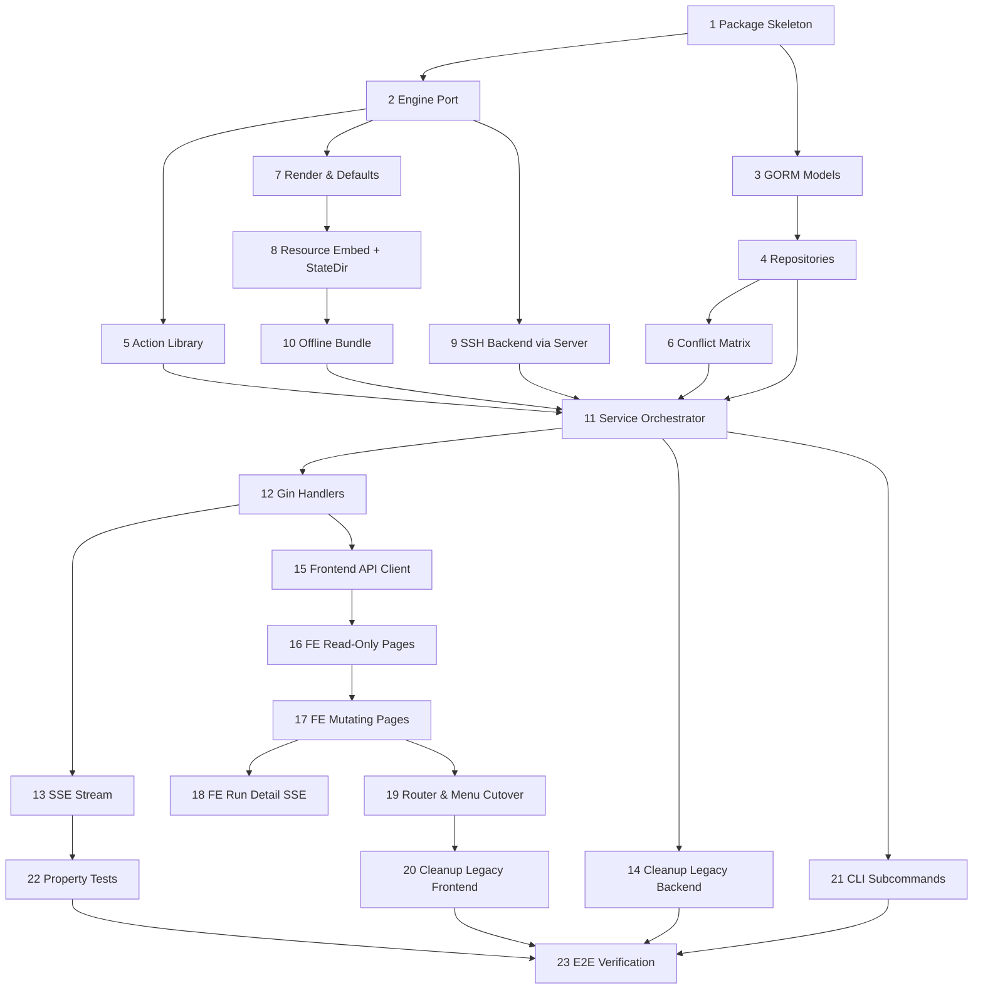

# Implementation Plan: Deployment Management

## Overview

将 his-deploy 的 HIS 基础设施离线部署能力迁入 df-build-system，作为"部署管理"模块替换现有"基础设施"占位模块。后端引擎按原语义搬运并改 import 路径，存储层从 SQLite 手写 store 重写为 GORM + PostgreSQL，主机管理复用现有服务器管理，前端按 df-build-system 风格重写。任务按 6 个迁移阶段组织：包边界 → 引擎搬运 → 存储重写 → Web 层 → 前端重写 → 资源迁移与清理。

## Task Dependency Graph



```json
{
  "waves": [
    { "wave": 1, "tasks": ["1"] },
    { "wave": 2, "tasks": ["2", "3"] },
    { "wave": 3, "tasks": ["4", "7", "9"] },
    { "wave": 4, "tasks": ["5", "6", "8"] },
    { "wave": 5, "tasks": ["10"] },
    { "wave": 6, "tasks": ["11"] },
    { "wave": 7, "tasks": ["12", "14", "21"] },
    { "wave": 8, "tasks": ["13", "15"] },
    { "wave": 9, "tasks": ["16", "22"] },
    { "wave": 10, "tasks": ["17"] },
    { "wave": 11, "tasks": ["18", "19"] },
    { "wave": 12, "tasks": ["20"] },
    { "wave": 13, "tasks": ["23"] }
  ]
}
```

## Tasks

- [x] 1. Package Skeleton (Phase 0)
  - [x] 1.1 Create `backend/internal/deploy/` directory tree per design (planner/runner/runtime/exec/actions/render/offline/defaults/conflict/statedir/handler/repository).
  - [x] 1.2 Add empty `service.go` with `Service` interface and constructor stub.
  - [x] 1.3 Add `doc.go` files in each sub-package documenting its responsibility.
  - [x] 1.4 Add placeholders so `go build ./internal/deploy/...` passes.
  - [x] 1.5 Verify `go build ./...` still succeeds with the new empty tree.
  - _Requirements: 10.3, 10.8_

- [x] 2. Engine Port (Phase 1)
  - [x] 2.1 Copy from `his-deploy/internal/dfctlv2/`: planner.go, runner.go, executor.go, types.go, errors.go, logger.go, command.go, config*.go, component_config.go, fileutil.go, pipeline_internal_data.go, deployment_files.go, resources.go into `backend/internal/deploy/`.
  - [x] 2.2 Copy `runtime/` into `backend/internal/deploy/runtime/`.
  - [x] 2.3 Copy `exec/` (backend.go, local.go, remote.go) into `backend/internal/deploy/exec/`.
  - [x] 2.4 Copy `virtualcomponents/` into `backend/internal/deploy/planner/virtualcomponents/`.
  - [x] 2.5 Copy `render/` and `offline/` into their new sub-packages.
  - [x] 2.6 Replace all `dfctl/...` import paths with `df-build-server/internal/deploy/...`.
  - [x] 2.7 Remove chi/sqlite/store references; stub functions depending on removed types with `// TODO(deploy)` returning `errors.New("not wired")`.
  - [x] 2.8 Run `go build ./internal/deploy/...` and fix compile errors by stubbing only, never deleting logic.
  - _Requirements: 10.3, 10.4, 10.5_

- [x] 3. GORM Models (Phase 2)
  - [x] 3.1 Add `model/deployment_run.go` (DeploymentRun, DeploymentRunComponent).
  - [x] 3.2 Add `model/deployment_state.go` (ComponentDeployState, component_code PK).
  - [x] 3.3 Add `model/deployment_target.go` (ComponentTarget, unique index on component_code+server_id).
  - [x] 3.4 Add `model/deployment_override.go` (ComponentOverride, DeploymentGlobalConfig single-row).
  - [x] 3.5 Add `model/deployment_log.go` (DeploymentLog, run_id index, seq column).
  - [x] 3.6 Add `model/deployment_offline.go` (OfflineBundle).
  - [x] 3.7 Register all 8 new models in `repository/migrate.go` AutoMigrate.
  - [x] 3.8 Remove legacy DeployPlan/DeployExecution/DeployLog/EnvironmentInfo from AutoMigrate (file deletion deferred to Task 14).
  - [x] 3.9 Add one-shot DROP of legacy `deploy_plans`/`deploy_executions`/`deploy_logs`/`environment_infos` tables if they exist.
  - [x] 3.10 Verify `go build ./...` and AutoMigrate run against PostgreSQL cleanly.
  - _Requirements: 1.2, 7.1, 10.2_

- [x] 4. Repositories (Phase 2)
  - [x] 4.1 `repository/run.go` — RunRepo (Create, Get, List paged, UpdateStatus, AppendComponent).
  - [x] 4.2 `repository/state.go` — StateRepo with atomic transition enforcing CP-1 in one transaction.
  - [x] 4.3 `repository/target.go` — TargetRepo (Get/Put/List/byServer); reads join `model.Server` for SSH credentials.
  - [x] 4.4 `repository/override.go` — OverrideRepo (Get/Put/Delete by component_code).
  - [x] 4.5 `repository/globalconfig.go` — GlobalConfigRepo (Get/Put single-row upsert).
  - [x] 4.6 `repository/log.go` — LogRepo (Append, ListPaged, ListAll, ListSince(seq)).
  - [x] 4.7 `repository/offline.go` — OfflineRepo (UpsertCurrent, GetCurrent).
  - [x] 4.8 Add startup hook in `cmd/server/main.go` finalizing orphaned `status=RUNNING` runs as FAILED.
  - [x] 4.9 Unit tests: state transition atomicity (CP-1), target unique constraint, log append/list-since.
  - _Requirements: 7.1, 7.2, 7.6, 7.8, 10.2_

- [ ] 5. Action Library Adapter (Phase 1+2)
  - [x] 5.1 `actions/registry.go` — global handler map + `Register(type, handler)`.
  - [x] 5.2 Move per-action bodies into `file.go`/`system.go`/`k8s.go`/`check.go`/`state.go`/`slb.go`/`command.go`.
  - [x] 5.3 Update handlers to take typed `Context` (run id, component, host, exec.Backend, statedir helper).
  - [ ] 5.4 Wire state actions (record_path_state/backup_file/restore_file/remove_path_if_*/assert_path_absent_if_created) to statedir (stub until Task 8).
  - [x] 5.5 Per-action unit tests using LocalBackend against temp dir; happy + error paths.
  - [x] 5.6 Test that fails if any required action type (Requirement 6.1, ~40 types) is missing from the registry.
  - _Requirements: 6.1, 6.2, 6.3, 6.4, 6.5, 6.6_

- [ ] 6. Conflict Matrix (Phase 2)
  - [x] 6.1 `conflict/matrix.go` — HardConflicts, K8sComponents, BusinessComponents constants.
  - [x] 6.2 Implement `Validate(bindings) []Conflict` (pair conflicts + K8s↔business per server).
  - [x] 6.3 Add `IsK8s(code)` / `IsBusiness(code)` helpers.
  - [x] 6.4 Property tests (rapid) for CP-3.
  - [ ] 6.5 Wire the conflict check into `TargetRepo.Put` so PUT /targets/{component} rejects conflicts.
  - _Requirements: 8.1, 8.2, 8.3, 8.5_

- [ ] 7. Render & Defaults (Phase 1+2)
  - [x] 7.1 Implement merge in `render/render.go`: defaults → globalConfig → override, with per-key provenance.
  - [x] 7.2 Go template renderer over merged map + host context (inline + render_template sources).
  - [x] 7.3 Password charset validator (reject `'"\$` backtick space); call from GlobalConfigRepo.Put and OverrideRepo.Put.
  - [x] 7.4 Property tests for merge precedence (CP-2).
  - [x] 7.5 Unit tests for password validator covering all forbidden characters.
  - _Requirements: 3.4, 3.5, 6.3_

- [ ] 8. Resource Embed + StateDir (Phase 5)
  - [ ] 8.1 Copy `his-deploy/resources/` into `backend/internal/deploy/resources/` (offline tree + manifest.yml).
  - [x] 8.2 Copy `his-deploy/config/components/*.yml` into `defaults/components/`.
  - [x] 8.3 Copy each component's pipeline YAML into `defaults/pipelines/`.
  - [x] 8.4 Add `//go:embed` in `defaults/defaults.go` and `defaults/pipelines.go`.
  - [ ] 8.5 Add `//go:embed all:resources` in `resources/resources.go` exposing an `fs.FS`.
  - [ ] 8.6 Update `actions/file.go` copy_file/extract_archive to read embedded FS unless an installed bundle overrides Resource_Dir.
  - [x] 8.7 Implement `statedir` package with marker conventions (created/backups/sysctl/meta.json) per design.
  - [x] 8.8 Replace Task 5.4 stubs with real statedir helpers.
  - _Requirements: 7.5, 11.1, 11.2, 11.3, 11.4, 11.5_

- [ ] 9. SSH Backend via Server (Phase 2)
  - [x] 9.1 `exec/remote.go` adapter takes `*model.Server`, decrypts credential via existing crypto helper, builds SSH/SFTP client.
  - [x] 9.2 Ensure no SSH credential is cached in deployment tables; dial reads live Server row.
  - [x] 9.3 Add a connection pool keyed by server_id with idle timeout.
  - [x] 9.4 Wire `runtime.Manager` to acquire/release connections per run.
  - [ ] 9.5 Unit tests: credential rotation between runs (CP-8), unreachable host failure.
  - _Requirements: 2.5, 2.6, 10.5_

- [ ] 10. Offline Bundle (Phase 5)
  - [x] 10.1 `offline/install.go`: stage archive to temp, verify sha256 vs manifest, atomic rename into Resource_Dir.
  - [x] 10.2 `offline/upload.go`: multipart upload to staging; reject paths outside upload dir.
  - [x] 10.3 Server-local-path install resolving symlinks via EvalSymlinks against an allow-list root.
  - [x] 10.4 `offline/status.go` returning current OfflineBundle + resource count summary.
  - [ ] 10.5 Fault-injection tests: kill mid-install → T0 or T1 only (CP-4); corrupt sha256 → abort, T0 intact.
  - [x] 10.6 `manifest.Generate(dir)` walking Resource_Dir to emit fresh manifest.yml.
  - _Requirements: 4.1, 4.2, 4.3, 4.4, 4.5, 4.6, 4.7, 4.8_

- [ ] 11. Service Orchestrator (Phase 2/3)
  - [x] 11.1 Implement `deploy.Service` wiring repositories + planner + runner + runtime + actions + render + offline + conflict.
  - [x] 11.2 `CreateRun`: state pre-check, conflict pre-check, persist run (PENDING), acquire runtime, transition RUNNING, run goroutine.
  - [x] 11.3 `Preview`: build plan only, no state transition, return actions grouped by host.
  - [x] 11.4 `Cancel`: `runtime.Manager.Cancel(runID)`; set CANCELED only after runner exits.
  - [x] 11.5 `Rollback`: state check (DEPLOYED or FAILED); run cleanup plan; transition NOT_DEPLOYED on success.
  - [x] 11.6 `GetRun`, `ListRuns`, `StreamLogs`.
  - [x] 11.7 SSE publish: every runner line mirrored to `pkg/sse` on `deployment.run.<id>` + persisted to DeploymentLog with monotonic seq.
  - [ ] 11.8 Integration test: deploy → reject re-deploy → rollback → re-deploy succeeds (CP-1, CP-5).
  - [ ] 11.9 Integration test: random cancel timing → terminal status ∈ {CANCELED, FAILED}, never SUCCESS (CP-7).
  - _Requirements: 5.1, 5.2, 5.3, 5.4, 5.5, 5.7, 5.8, 7.1, 7.2, 7.3, 7.4, 7.6, 7.8_

- [ ] 12. Gin Handlers (Phase 3)
  - [x] 12.1 `handler/handler.go` with `RegisterRoutes(r)` registering all `/api/deployment/*` behind JWT.
  - [x] 12.2 `runs.go`: runs CRUD + preview + rollback + running + logs + logs.txt + cancel.
  - [x] 12.3 `targets.go`: GET/PUT targets, POST /host-checks.
  - [x] 12.4 `globalconfig.go`: GET/PUT global-config with password-charset validation.
  - [x] 12.5 `overrides.go`: GET/PUT/DELETE overrides.
  - [x] 12.6 `offline.go`: status/upload/install.
  - [x] 12.7 `components.go`: components list/detail/tasks/enabled.
  - [x] 12.8 Unified `{code,message,data}` responses; map service errors to the design's HTTP/code table.
  - [x] 12.9 Register the deployment route group from `cmd/server/main.go`.
  - _Requirements: 3.1, 3.2, 3.3, 4.1, 4.2, 4.6, 5.1, 5.2, 5.6, 5.7, 8.4, 10.1, 10.7_

- [ ] 13. SSE Stream Adapter (Phase 3)
  - [x] 13.1 `handler/stream.go` with `GET /api/deployment/runs/{id}/events`.
  - [x] 13.2 On subscribe, replay existing DeploymentLog rows by seq, then attach to live `pkg/sse` channel.
  - [x] 13.3 Send `event: done` on terminal status; close connection.
  - [ ] 13.4 Integration test: N concurrent subscribers at random offsets each get a contiguous prefix (CP-6).
  - _Requirements: 5.5, 9.4, 10.6_

- [ ] 14. Cleanup Legacy Backend (Phase 6)
  - [x] 14.1 Delete `backend/internal/deployer/` package.
  - [x] 14.2 Delete `backend/internal/handler/deploy.go` and its route registration.
  - [x] 14.3 Delete `backend/internal/model/deploy.go`.
  - [x] 14.4 grep and remove every remaining `internal/deployer` / `model.DeployPlan` / `/api/deploy` reference.
  - [x] 14.5 Verify `go build ./...` and `go vet ./...` are clean.
  - [x] 14.6 Verify no chi or SQLite imports remain in `backend/`.
  - _Requirements: 1.1, 1.2, 1.5, 10.4, 10.8, 12.6_

- [ ] 15. Frontend API Client (Phase 4)
  - [x] 15.1 `frontend/src/api/deployment.ts` with TS interfaces matching backend DTOs.
  - [x] 15.2 API functions for components/global-config/overrides/targets/host-checks/runs/offline.
  - [x] 15.3 All functions go through the existing `request` axios instance.
  - [x] 15.4 `eventSource(runId)` helper opening EventSource with JWT in query (matching pipeline-detail SSE pattern).
  - _Requirements: 9.3, 9.4, 10.6_

- [ ] 16. Frontend Read-Only Pages (Phase 4)
  - [x] 16.1 `DeploymentDashboardView.vue` overview tiles (running/today/last bundle/deployed count) in df style.
  - [x] 16.2 `DeploymentComponentsView.vue` listing 23 components (code/name/order/category/state) + detail drawer.
  - [x] 16.3 `DeploymentRunsView.vue` paginated runs table with status tags + `formatTimeStr`.
  - _Requirements: 9.1, 9.2, 9.5, 9.6_

- [ ] 17. Frontend Mutating Pages (Phase 4)
  - [x] 17.1 `DeploymentTargetsView.vue` component selector + bound servers sourced from existing Server Management.
  - [x] 17.2 On Save call PUT /targets/{component}; surface 409 conflicts inline naming the conflicting pair.
  - [x] 17.3 `DeploymentGlobalConfigView.vue` categorized editor; inline password-charset validation errors.
  - [x] 17.4 `DeploymentOfflineView.vue` upload dropzone + server-local path + bundle metadata + install progress.
  - [ ] 17.5 ComponentOverride editor (modal JSON editor with shell-charset feedback).
  - _Requirements: 2.1, 2.2, 2.3, 2.4, 3.1, 3.2, 3.3, 3.5, 4.1, 4.2, 4.3, 4.4, 4.5, 8.3, 9.2, 9.5, 9.7_

- [ ] 18. Frontend Run Detail SSE (Phase 4)
  - [x] 18.1 `DeploymentRunDetailView.vue` overview card + live log card per wireframe.
  - [x] 18.2 On mount subscribe via `eventSource(runId)`; replay history from /runs/{id}/logs then append live.
  - [x] 18.3 Cancel button while RUNNING; disabled on terminal.
  - [x] 18.4 Rollback button while status ∈ {SUCCESS, FAILED} per component.
  - [x] 18.5 Auto-scroll log panel + stick-to-bottom toggle (mirror pipeline-detail UX).
  - _Requirements: 5.5, 5.7, 7.3, 9.4, 9.8_

- [ ] 19. Router & Menu Cutover (Phase 4)
  - [x] 19.1 Register new `/deployment/*` routes for the 7 views.
  - [x] 19.2 Add sidebar group "部署管理": 概览/组件/主机绑定/全局配置/离线包/部署运行.
  - [x] 19.3 Add legacy redirects for `/infra/check|plan|execute|environment`.
  - [x] 19.4 Remove the "基础设施" sidebar group entry.
  - [x] 19.5 Verify `npx vue-tsc --noEmit` passes and the new menu renders.
  - _Requirements: 1.3, 1.4, 9.5_

- [ ] 20. Cleanup Legacy Frontend (Phase 6)
  - [x] 20.1 Delete InfraCheckView/InfraPlanView/InfraExecuteView/InfraEnvironmentView.vue.
  - [x] 20.2 Remove any imports/references to those files.
  - [x] 20.3 Verify `npx vue-tsc --noEmit` and `npm run build` are clean.
  - _Requirements: 1.3_

- [ ] 21. CLI Subcommands (Phase 5)
  - [x] 21.1 Add a `deploy` subcommand group to `cmd/server` (keep single binary).
  - [x] 21.2 `df-build-server deploy verify` reproducing sha256 + manifest reverse check.
  - [x] 21.3 `df-build-server deploy manifest gen <dir>` writing a fresh manifest.yml.
  - [x] 21.4 Both exit non-zero on failure with a clear summary.
  - [x] 21.5 Unit tests against synthetic trees (clean + tampered manifests).
  - _Requirements: 4.7, 4.8, 11.5_

- [ ] 22. Property Tests (Phase 6)
  - [x] 22.1 `render/merge_property_test.go` — CP-2 parameter merge precedence (rapid).
  - [x] 22.2 `conflict/matrix_property_test.go` — CP-3 conflict matrix invariant.
  - [x] 22.3 `offline/atomic_property_test.go` — CP-4 install atomicity under fault injection.
  - [x] 22.4 `repository/state_property_test.go` — CP-1 state machine atomicity.
  - [x] 22.5 `handler/sse_property_test.go` — CP-6 no-loss SSE replay.
  - [x] 22.6 Run `go test -count=10 -timeout=10m ./internal/deploy/...` to shake out flakiness.
  - _Requirements: 3.4, 4.3, 4.4, 4.5, 5.5, 5.7, 7.1, 7.2, 7.4, 7.5, 7.6, 7.8, 8.1, 8.2_

- [ ] 23. End-to-End Verification (Phase 6)
  - [x] 23.1 Run `bash scripts/deploy_server_build.sh`; verify HTTP 200 on port 8800.
  - [ ] 23.2 Exercise menu: add target binding, edit global config, upload bundle, preview, run `prepare`, watch SSE, rollback.
  - [x] 23.3 Verify legacy `/infra/*` URLs redirect to `/deployment/*`.
  - [x] 23.4 Confirm `grep -r "dfctl\|chi\.\|glebarez/sqlite" backend/` returns zero results.
  - [x] 23.5 Update `README.md` with a "部署管理" section + dual-persistence-root migration warning.
  - [x] 23.6 Write `docs/deployment-management.md` (overview, migration decisions, manual-data-migration note).
  - _Requirements: 1.1, 1.2, 1.3, 1.4, 1.5, 7.9, 9.1, 9.2, 12.1, 12.4, 12.5, 12.6_

## Notes

- 迁移按 6 阶段提交，每阶段独立可编译/可测试，便于 review 与回退。
- State_Dir（rollback marker）始终保留为目标主机本地文件，不入 PostgreSQL。
- 主机管理复用现有服务器管理（model.Server），SSH 凭据单一来源，不再复制。
- 验证命令：`cd backend && go build ./... && go test ./internal/deploy/...`；`cd frontend && npx vue-tsc --noEmit && npm run build`。
- 部署命令：`bash scripts/deploy_server_build.sh`（服务器端编译，Mac 无需 Docker）。
- 历史 his-deploy SQLite 数据与 state_dir 不自动迁移，需运维手动处理，超出本特性范围。
