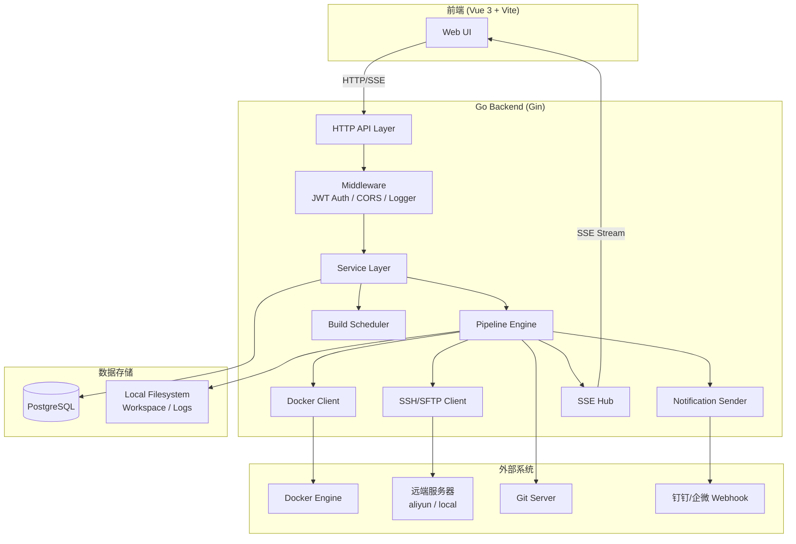
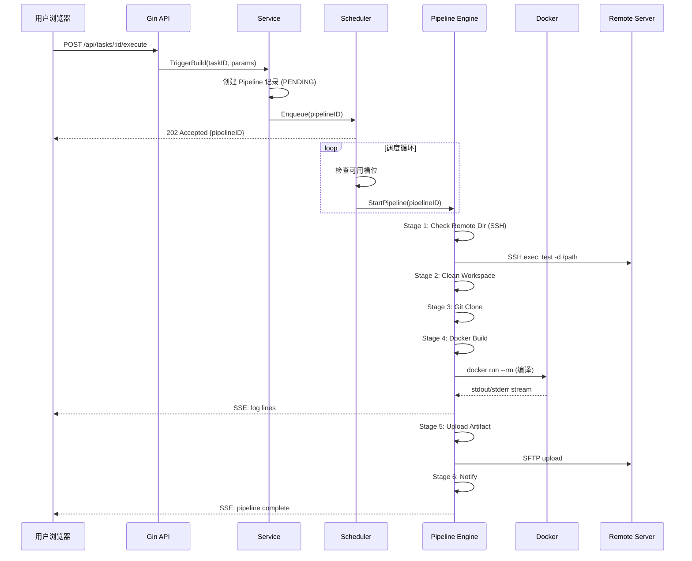
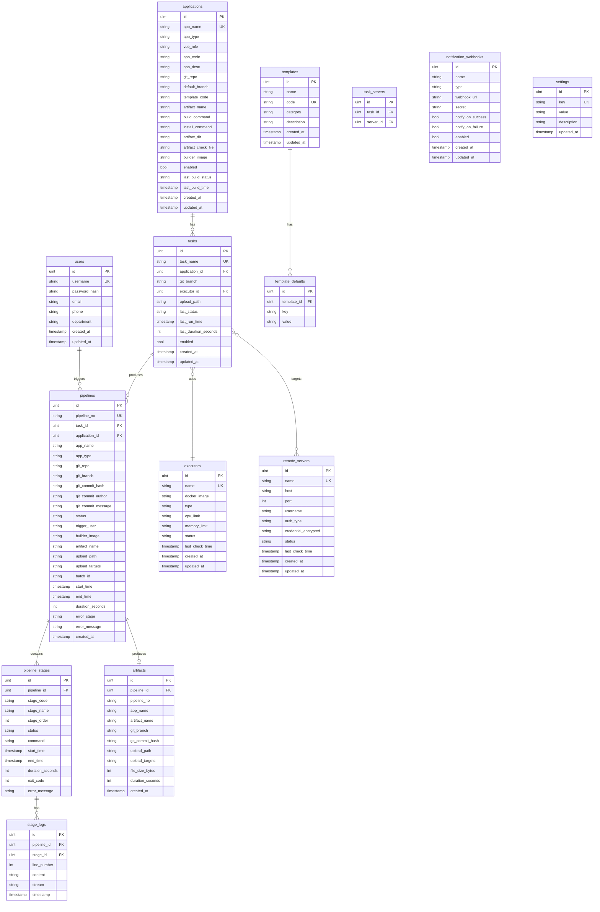
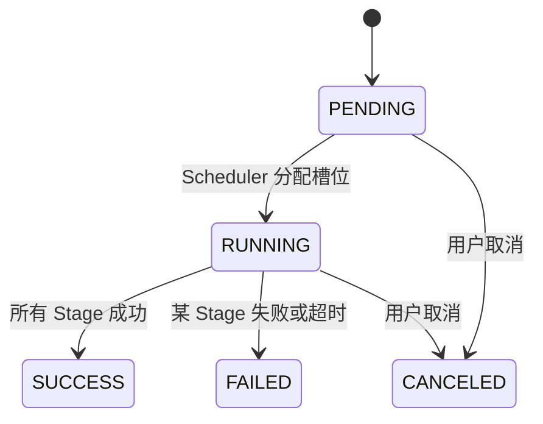
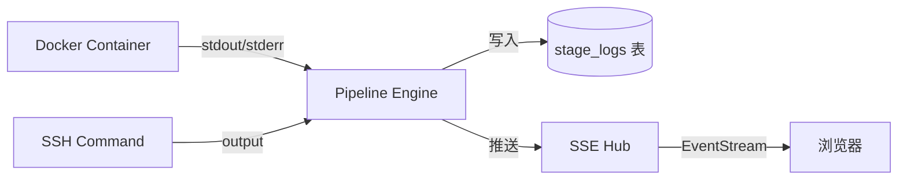
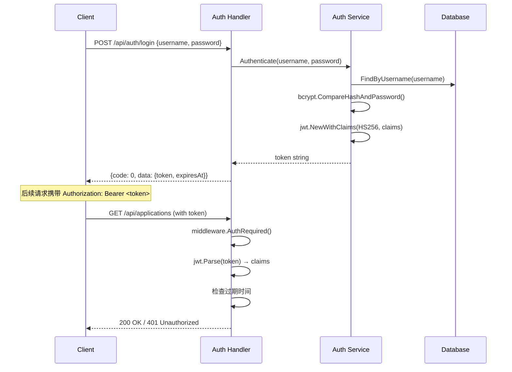

# Design Document: DF Build System Go Backend

## Overview

DF 构建发布系统后端采用 Go 语言实现，提供 RESTful API 服务，核心职责包括：

1. **构建流水线引擎** — 编排多阶段构建任务，通过 Docker SDK 执行编译，通过 SSH/SFTP 上传产物
2. **并发调度器** — FIFO 队列 + 可配置并发槽位，确保构建机资源不被耗尽
3. **实时日志推送** — 通过 SSE 将构建日志和远程操作输出实时推送到前端
4. **凭据安全管理** — AES-256 加密存储 SSH 密码/私钥，运行时解密
5. **通知集成** — 构建完成后通过钉钉/企微 Webhook 推送结果

系统替代原有 Jenkins + Python 脚本方案，将构建配置、执行、监控统一到单一平台。

---

## Architecture

### 系统架构图



### 请求流转



---

## Components and Interfaces

### Go 项目结构

```
df-build-server/
├── cmd/
│   └── server/
│       └── main.go                 # 程序入口
├── internal/
│   ├── handler/                    # HTTP Handler 层
│   │   ├── auth.go
│   │   ├── application.go
│   │   ├── task.go
│   │   ├── pipeline.go
│   │   ├── build_queue.go
│   │   ├── remote.go
│   │   ├── artifact.go
│   │   ├── settings.go
│   │   ├── template.go
│   │   ├── executor.go
│   │   ├── server.go
│   │   ├── notification.go
│   │   └── dashboard.go
│   ├── service/                    # 业务逻辑层
│   │   ├── auth_service.go
│   │   ├── user_service.go
│   │   ├── application_service.go
│   │   ├── task_service.go
│   │   ├── pipeline_service.go
│   │   ├── build_queue_service.go
│   │   ├── remote_service.go
│   │   ├── artifact_service.go
│   │   ├── settings_service.go
│   │   ├── template_service.go
│   │   ├── executor_service.go
│   │   ├── server_service.go
│   │   ├── notification_service.go
│   │   └── dashboard_service.go
│   ├── repository/                 # 数据访问层
│   │   ├── application_repo.go
│   │   ├── task_repo.go
│   │   ├── pipeline_repo.go
│   │   ├── stage_repo.go
│   │   ├── artifact_repo.go
│   │   ├── settings_repo.go
│   │   ├── template_repo.go
│   │   ├── executor_repo.go
│   │   ├── server_repo.go
│   │   ├── notification_repo.go
│   │   └── user_repo.go
│   ├── model/                      # GORM 数据模型
│   │   ├── user.go
│   │   ├── application.go
│   │   ├── task.go
│   │   ├── pipeline.go
│   │   ├── stage.go
│   │   ├── stage_log.go
│   │   ├── artifact.go
│   │   ├── settings.go
│   │   ├── template.go
│   │   ├── executor.go
│   │   ├── remote_server.go
│   │   └── notification.go
│   ├── pipeline/                   # 流水线执行引擎
│   │   ├── engine.go              # 主引擎：编排 Stage 执行
│   │   ├── stage_runner.go        # Stage 执行器接口
│   │   ├── stages/                # 各 Stage 实现
│   │   │   ├── check_remote.go
│   │   │   ├── clean_workspace.go
│   │   │   ├── git_clone.go
│   │   │   ├── docker_build.go
│   │   │   ├── zip_package.go
│   │   │   ├── upload_artifact.go
│   │   │   └── notify.go
│   │   └── workspace.go          # 工作目录管理
│   ├── scheduler/                  # 构建调度器
│   │   ├── scheduler.go           # FIFO 队列 + 并发控制
│   │   └── slot_manager.go        # 槽位管理
│   ├── docker/                     # Docker 客户端封装
│   │   ├── client.go
│   │   └── container.go
│   ├── ssh/                        # SSH/SFTP 客户端封装
│   │   ├── client.go
│   │   └── sftp.go
│   ├── notification/               # 通知发送
│   │   ├── sender.go
│   │   ├── dingtalk.go
│   │   └── wecom.go
│   └── middleware/                 # 中间件
│       ├── auth.go
│       ├── cors.go
│       └── logger.go
├── pkg/
│   ├── config/                     # 配置加载 (Viper)
│   │   └── config.go
│   ├── crypto/                     # 加密工具 (AES-256)
│   │   └── aes.go
│   ├── sse/                        # SSE 推送
│   │   └── hub.go
│   ├── response/                   # 统一响应格式
│   │   └── response.go
│   └── logger/                     # 日志初始化 (Zap)
│       └── logger.go
├── config/
│   └── config.yaml                 # 默认配置文件
├── migrations/                     # 数据库迁移脚本
│   └── ...
├── Dockerfile
├── docker-compose.yml
├── Makefile
└── go.mod
```

### 核心接口定义

```go
// Pipeline Engine 接口
type PipelineEngine interface {
    Execute(ctx context.Context, pipeline *model.Pipeline) error
    Cancel(pipelineID uint) error
}

// Stage Runner 接口
type StageRunner interface {
    Name() string
    Run(ctx context.Context, workspace *Workspace, pipeline *model.Pipeline) (*StageResult, error)
}

// Scheduler 接口
type Scheduler interface {
    Enqueue(pipelineID uint) error
    Cancel(pipelineID uint) error
    GetRunning() []uint
    GetPending() []uint
    SetConcurrency(limit int)
}

// SSE Hub 接口
type SSEHub interface {
    Subscribe(pipelineID uint) <-chan SSEEvent
    Unsubscribe(pipelineID uint, ch <-chan SSEEvent)
    Publish(pipelineID uint, event SSEEvent)
    Close(pipelineID uint)
}

// Docker Client 接口
type DockerClient interface {
    RunContainer(ctx context.Context, opts ContainerOpts) (io.ReadCloser, error)
    StopContainer(ctx context.Context, containerID string) error
    PullImage(ctx context.Context, image string) error
}

// SSH Client 接口
type SSHClient interface {
    Connect(server *model.RemoteServer) error
    Exec(ctx context.Context, cmd string) (stdout, stderr io.Reader, err error)
    Upload(ctx context.Context, localPath, remotePath string) error
    Close() error
}
```

---

## Data Models

### ER 关系图



### 表结构详细定义

#### users 表
| 字段 | 类型 | 约束 | 说明 |
|------|------|------|------|
| id | BIGINT | PK, AUTO_INCREMENT | 主键 |
| username | VARCHAR(64) | UNIQUE, NOT NULL | 用户名 |
| password_hash | VARCHAR(255) | NOT NULL | bcrypt 哈希密码 |
| email | VARCHAR(128) | | 邮箱 |
| phone | VARCHAR(20) | | 手机号 |
| department | VARCHAR(64) | | 部门 |
| created_at | TIMESTAMP | NOT NULL | 创建时间 |
| updated_at | TIMESTAMP | NOT NULL | 更新时间 |

#### applications 表
| 字段 | 类型 | 约束 | 说明 |
|------|------|------|------|
| id | BIGINT | PK | 主键 |
| app_name | VARCHAR(128) | UNIQUE, NOT NULL | 应用名称 |
| app_type | VARCHAR(20) | NOT NULL | 项目类型: java/vue |
| vue_role | VARCHAR(20) | | Vue 角色: main/sub/standalone |
| app_code | VARCHAR(10) | | 子应用编号 |
| app_desc | VARCHAR(255) | | 应用描述 |
| git_repo | VARCHAR(512) | NOT NULL | Git 仓库地址 |
| default_branch | VARCHAR(128) | DEFAULT 'master' | 默认分支 |
| template_code | VARCHAR(32) | | 关联模板编码 |
| artifact_name | VARCHAR(128) | | 产物文件名 |
| build_command | VARCHAR(512) | | 构建命令 |
| install_command | VARCHAR(512) | | 安装依赖命令 |
| artifact_dir | VARCHAR(256) | | 产物目录 |
| artifact_check_file | VARCHAR(256) | | 产物校验文件 |
| builder_image | VARCHAR(256) | | Docker 镜像 |
| enabled | BOOLEAN | DEFAULT true | 是否启用 |
| last_build_status | VARCHAR(20) | | 最近构建状态 |
| last_build_time | TIMESTAMP | | 最近构建时间 |
| created_at | TIMESTAMP | NOT NULL | |
| updated_at | TIMESTAMP | NOT NULL | |

#### tasks 表
| 字段 | 类型 | 约束 | 说明 |
|------|------|------|------|
| id | BIGINT | PK | 主键 |
| task_name | VARCHAR(128) | UNIQUE, NOT NULL | 任务名称 |
| application_id | BIGINT | FK → applications.id | 关联应用 |
| git_branch | VARCHAR(128) | NOT NULL | 构建分支 |
| executor_id | BIGINT | FK → executors.id | 执行器 |
| upload_path | VARCHAR(512) | NOT NULL | 远端上传路径 |
| last_status | VARCHAR(20) | | 最近执行状态 |
| last_run_time | TIMESTAMP | | 最近执行时间 |
| last_duration_seconds | INT | | 最近执行耗时 |
| enabled | BOOLEAN | DEFAULT true | 是否启用 |
| created_at | TIMESTAMP | | |
| updated_at | TIMESTAMP | | |

#### pipelines 表
| 字段 | 类型 | 约束 | 说明 |
|------|------|------|------|
| id | BIGINT | PK | 主键 |
| pipeline_no | VARCHAR(32) | UNIQUE, NOT NULL | 流水线编号 PUB-YYYYMMDD-NNNN |
| task_id | BIGINT | FK → tasks.id | 关联任务 |
| application_id | BIGINT | FK → applications.id | 关联应用 |
| app_name | VARCHAR(128) | NOT NULL | 冗余应用名 |
| app_type | VARCHAR(20) | | 冗余项目类型 |
| git_repo | VARCHAR(512) | | Git 仓库 |
| git_branch | VARCHAR(128) | | 构建分支 |
| git_commit_hash | VARCHAR(64) | | Git SHA |
| git_commit_author | VARCHAR(64) | | 提交者 |
| git_commit_message | TEXT | | 提交信息 |
| status | VARCHAR(20) | NOT NULL, DEFAULT 'PENDING' | PENDING/RUNNING/SUCCESS/FAILED/CANCELED |
| trigger_user | VARCHAR(64) | NOT NULL | 触发人 |
| builder_image | VARCHAR(256) | | 构建镜像 |
| artifact_name | VARCHAR(128) | | 产物名 |
| upload_path | VARCHAR(512) | | 上传路径 |
| upload_targets | VARCHAR(512) | | 目标服务器列表(逗号分隔) |
| batch_id | VARCHAR(64) | | 批次 ID (批量构建时) |
| start_time | TIMESTAMP | | 开始时间 |
| end_time | TIMESTAMP | | 结束时间 |
| duration_seconds | INT | | 总耗时 |
| error_stage | VARCHAR(64) | | 失败阶段名 |
| error_message | TEXT | | 错误信息 |
| created_at | TIMESTAMP | NOT NULL | |

#### pipeline_stages 表
| 字段 | 类型 | 约束 | 说明 |
|------|------|------|------|
| id | BIGINT | PK | 主键 |
| pipeline_id | BIGINT | FK → pipelines.id, INDEX | 关联流水线 |
| stage_code | VARCHAR(32) | NOT NULL | 阶段编码 |
| stage_name | VARCHAR(64) | NOT NULL | 阶段名称 |
| stage_order | INT | NOT NULL | 执行顺序 |
| status | VARCHAR(20) | DEFAULT 'PENDING' | PENDING/RUNNING/SUCCESS/FAILED/SKIPPED |
| command | TEXT | | 执行命令 |
| start_time | TIMESTAMP | | |
| end_time | TIMESTAMP | | |
| duration_seconds | INT | | |
| exit_code | INT | | |
| error_message | TEXT | | |

#### stage_logs 表
| 字段 | 类型 | 约束 | 说明 |
|------|------|------|------|
| id | BIGINT | PK | 主键 |
| pipeline_id | BIGINT | INDEX | 关联流水线 |
| stage_id | BIGINT | FK → pipeline_stages.id, INDEX | 关联阶段 |
| line_number | INT | NOT NULL | 行号 |
| content | TEXT | | 日志内容 |
| stream | VARCHAR(10) | | stdout/stderr |
| timestamp | TIMESTAMP | | 时间戳 |

#### settings 表
| 字段 | 类型 | 约束 | 说明 |
|------|------|------|------|
| id | BIGINT | PK | 主键 |
| key | VARCHAR(64) | UNIQUE, NOT NULL | 配置键 |
| value | TEXT | | 配置值 |
| description | VARCHAR(255) | | 说明 |
| updated_at | TIMESTAMP | | |

**预置 settings 数据：**
- `concurrency_limit` = "5" (并发限制)
- `build_timeout_seconds` = "1800" (构建超时)
- `log_retention_days` = "30" (日志保留天数)
- `default_upload_path` = "/root/DFHIS/his-release" (默认上传路径)
- `clean_workspace_after_build` = "true" (构建后清理)

---

## API Design

### 统一响应格式

```go
type Response struct {
    Code    int         `json:"code"`    // 0=成功, 非0=错误码
    Message string      `json:"message"` // 提示信息
    Data    interface{} `json:"data"`    // 响应数据
}

type PageResponse struct {
    Code    int         `json:"code"`
    Message string      `json:"message"`
    Data    PageData    `json:"data"`
}

type PageData struct {
    List     interface{} `json:"list"`
    Total    int64       `json:"total"`
    Page     int         `json:"page"`
    PageSize int         `json:"pageSize"`
}
```

### API 路由表

#### Auth 认证模块

| Method | Path | Handler | 说明 |
|--------|------|---------|------|
| POST | /api/auth/login | AuthHandler.Login | 用户登录，返回 JWT |
| POST | /api/auth/logout | AuthHandler.Logout | 退出登录 |
| GET | /api/auth/profile | AuthHandler.GetProfile | 获取当前用户信息 |
| PUT | /api/auth/profile | AuthHandler.UpdateProfile | 更新个人信息 |
| POST | /api/auth/change-password | AuthHandler.ChangePassword | 修改密码 |
| POST | /api/auth/send-code | AuthHandler.SendVerifyCode | 发送验证码 |

#### Applications 应用管理

| Method | Path | Handler | 说明 |
|--------|------|---------|------|
| GET | /api/applications | AppHandler.List | 应用列表(分页/搜索/筛选) |
| GET | /api/applications/:id | AppHandler.Get | 应用详情 |
| POST | /api/applications | AppHandler.Create | 创建应用 |
| PUT | /api/applications/:id | AppHandler.Update | 更新应用 |
| DELETE | /api/applications/:id | AppHandler.Delete | 删除应用 |
| POST | /api/applications/:id/copy | AppHandler.Copy | 复制应用 |

#### Tasks 任务管理

| Method | Path | Handler | 说明 |
|--------|------|---------|------|
| GET | /api/tasks | TaskHandler.List | 任务列表 |
| GET | /api/tasks/:id | TaskHandler.Get | 任务详情 |
| POST | /api/tasks | TaskHandler.Create | 创建任务 |
| PUT | /api/tasks/:id | TaskHandler.Update | 更新任务 |
| DELETE | /api/tasks/:id | TaskHandler.Delete | 删除任务 |
| POST | /api/tasks/:id/execute | TaskHandler.Execute | 触发单次构建 |
| POST | /api/tasks/batch-execute | TaskHandler.BatchExecute | 批量构建 |

#### Pipelines 流水线/构建历史

| Method | Path | Handler | 说明 |
|--------|------|---------|------|
| GET | /api/pipelines | PipelineHandler.List | 构建历史列表 |
| GET | /api/pipelines/:id | PipelineHandler.Get | 流水线详情(含 stages) |
| POST | /api/pipelines/:id/cancel | PipelineHandler.Cancel | 取消构建 |
| POST | /api/pipelines/:id/retry | PipelineHandler.Retry | 重试构建 |
| GET | /api/pipelines/:id/stages/:stageId/logs | PipelineHandler.GetStageLogs | 获取阶段日志 |
| GET | /api/pipelines/:id/logs/stream | PipelineHandler.StreamLogs | SSE 实时日志流 |

#### Build Queue 构建队列

| Method | Path | Handler | 说明 |
|--------|------|---------|------|
| GET | /api/build-queue | QueueHandler.Get | 获取队列状态(running + pending) |
| DELETE | /api/build-queue/:id | QueueHandler.Cancel | 取消排队中的构建 |

#### Remote Operations 远程操作

| Method | Path | Handler | 说明 |
|--------|------|---------|------|
| POST | /api/remote/sync | RemoteHandler.Sync | 发起远程同步 |
| GET | /api/remote/sync/:id/stream | RemoteHandler.SyncStream | SSE 同步日志流 |
| POST | /api/remote/package | RemoteHandler.Package | 发起远程打包 |
| GET | /api/remote/package/:id/stream | RemoteHandler.PackageStream | SSE 打包日志流 |

#### Artifacts 制品记录

| Method | Path | Handler | 说明 |
|--------|------|---------|------|
| GET | /api/artifacts | ArtifactHandler.List | 制品列表(分页/搜索) |

#### Settings 全局设置

| Method | Path | Handler | 说明 |
|--------|------|---------|------|
| GET | /api/settings | SettingsHandler.GetAll | 获取所有设置 |
| PUT | /api/settings | SettingsHandler.Update | 批量更新设置 |

#### Templates 模板管理

| Method | Path | Handler | 说明 |
|--------|------|---------|------|
| GET | /api/templates | TemplateHandler.List | 模板列表 |
| GET | /api/templates/:id | TemplateHandler.Get | 模板详情(含 defaults) |
| POST | /api/templates | TemplateHandler.Create | 创建模板 |
| PUT | /api/templates/:id | TemplateHandler.Update | 更新模板 |
| DELETE | /api/templates/:id | TemplateHandler.Delete | 删除模板 |

#### Executors 执行器管理

| Method | Path | Handler | 说明 |
|--------|------|---------|------|
| GET | /api/executors | ExecutorHandler.List | 执行器列表 |
| POST | /api/executors | ExecutorHandler.Create | 创建执行器 |
| PUT | /api/executors/:id | ExecutorHandler.Update | 更新执行器 |
| DELETE | /api/executors/:id | ExecutorHandler.Delete | 删除执行器 |

#### Remote Servers 远端服务器

| Method | Path | Handler | 说明 |
|--------|------|---------|------|
| GET | /api/servers | ServerHandler.List | 服务器列表 |
| POST | /api/servers | ServerHandler.Create | 添加服务器 |
| PUT | /api/servers/:id | ServerHandler.Update | 更新服务器 |
| DELETE | /api/servers/:id | ServerHandler.Delete | 删除服务器 |
| POST | /api/servers/:id/test | ServerHandler.TestConnection | 测试连接 |

#### Notifications 通知管理

| Method | Path | Handler | 说明 |
|--------|------|---------|------|
| GET | /api/notifications | NotifyHandler.List | Webhook 列表 |
| POST | /api/notifications | NotifyHandler.Create | 创建 Webhook |
| PUT | /api/notifications/:id | NotifyHandler.Update | 更新 Webhook |
| DELETE | /api/notifications/:id | NotifyHandler.Delete | 删除 Webhook |
| POST | /api/notifications/:id/test | NotifyHandler.Test | 测试发送 |

#### Dashboard 工作台

| Method | Path | Handler | 说明 |
|--------|------|---------|------|
| GET | /api/dashboard/stats | DashboardHandler.GetStats | 统计数据 |
| GET | /api/dashboard/recent-builds | DashboardHandler.RecentBuilds | 最近构建 |

---

## Pipeline Execution Engine Design

### 阶段编排

Pipeline Engine 是系统核心，负责按序执行各 Stage 并处理失败/超时。



### Stage 执行流程

```go
func (e *Engine) Execute(ctx context.Context, pipeline *model.Pipeline) error {
    // 1. 根据 app_type 确定 stage 列表
    stages := e.resolveStages(pipeline)
    
    // 2. 创建带超时的 context
    timeout := e.getTimeout()
    ctx, cancel := context.WithTimeout(ctx, timeout)
    defer cancel()
    
    // 3. 逐个执行 stage
    for _, stage := range stages {
        select {
        case <-ctx.Done():
            // 超时处理
            e.markTimeout(pipeline, stage)
            return ErrBuildTimeout
        default:
            result, err := stage.Run(ctx, workspace, pipeline)
            if err != nil {
                e.markFailed(pipeline, stage, err)
                e.skipRemaining(stages)
                return err
            }
            e.markSuccess(stage, result)
        }
    }
    
    e.markPipelineSuccess(pipeline)
    return nil
}
```

### Java 应用 Stage 序列

| 顺序 | Stage Code | 说明 | 执行方式 |
|------|-----------|------|---------|
| 1 | CHECK_REMOTE_DIR | 检查远端目录是否存在，不存在则创建 | SSH |
| 2 | CLEAN_WORKSPACE | 清理本地工作目录 | 本地 |
| 3 | GIT_CLONE | 克隆代码到工作目录 | 本地 (git) |
| 4 | GRADLE_BUILD | 执行 `gradle clean build -x test` | Docker 容器 |
| 5 | UPLOAD_ARTIFACT | 上传 .jar 到远端服务器 | SFTP |
| 6 | NOTIFY | 发送构建结果通知 | HTTP (Webhook) |

### Vue 应用 Stage 序列

| 顺序 | Stage Code | 说明 | 执行方式 |
|------|-----------|------|---------|
| 1 | CHECK_REMOTE_DIR | 检查远端目录 | SSH |
| 2 | CLEAN_WORKSPACE | 清理工作目录 | 本地 |
| 3 | GIT_CLONE | 克隆代码 | 本地 (git) |
| 4 | YARN_BUILD | 执行 `yarn install && npm run build:new` | Docker 容器 |
| 5 | ZIP_PACKAGE | 打包 dist 为 zip | 本地 |
| 6 | UPLOAD_ARTIFACT | 上传 .zip 到远端 | SFTP |
| 7 | NOTIFY | 发送通知 | HTTP |

### Docker 容器生命周期

```go
func (s *DockerBuildStage) Run(ctx context.Context, ws *Workspace, p *model.Pipeline) (*StageResult, error) {
    opts := docker.ContainerOpts{
        Image:      p.BuilderImage,
        Command:    []string{"sh", "-c", p.BuildCommand},
        WorkDir:    "/workspace",
        Mounts:     []docker.Mount{{Source: ws.SourceDir(), Target: "/workspace"}},
        CPULimit:   executor.CPULimit,
        MemLimit:   executor.MemoryLimit,
        AutoRemove: true,
    }
    
    // 启动容器并获取输出流
    reader, err := s.docker.RunContainer(ctx, opts)
    if err != nil {
        return nil, err
    }
    defer reader.Close()
    
    // 逐行读取并推送到 SSE
    scanner := bufio.NewScanner(reader)
    for scanner.Scan() {
        line := scanner.Text()
        s.sseHub.Publish(p.ID, SSEEvent{
            Type: "log",
            Data: LogLine{Content: line, Stream: "stdout"},
        })
        s.storeLog(p.ID, stageID, line)
    }
    
    // 获取容器退出码
    exitCode := s.docker.WaitContainer(ctx, containerID)
    return &StageResult{ExitCode: exitCode}, nil
}
```

### 日志捕获与 SSE 推送



- 每行日志同时写入数据库和推送到 SSE Hub
- SSE Hub 使用 channel per pipeline，支持多客户端订阅同一 pipeline
- 构建完成后关闭 channel，客户端收到 `event: done`

### 超时处理

```go
// 超时由 context.WithTimeout 控制
// 当 ctx.Done() 触发时：
// 1. 如果在 Docker 容器中 → docker stop containerID
// 2. 如果在 SSH 命令中 → 关闭 SSH session
// 3. 标记当前 stage 为 FAILED，error_message = "Build timeout exceeded"
// 4. 标记后续 stages 为 SKIPPED
// 5. 标记 pipeline 为 FAILED
// 6. 通知 Scheduler 释放槽位
```

### Workspace 管理

```go
type Workspace struct {
    BaseDir    string // /opt/df-build/workspaces
    PipelineID uint
}

func (w *Workspace) Root() string {
    return filepath.Join(w.BaseDir, fmt.Sprintf("pipeline-%d", w.PipelineID))
}

func (w *Workspace) SourceDir() string {
    return filepath.Join(w.Root(), "source")
}

func (w *Workspace) ArtifactDir() string {
    return filepath.Join(w.Root(), "artifacts")
}

func (w *Workspace) Clean() error {
    return os.RemoveAll(w.Root())
}
```

---

## Scheduler Design

### FIFO 队列实现

```go
type BuildScheduler struct {
    mu          sync.Mutex
    queue       []uint          // pending pipeline IDs (FIFO)
    running     map[uint]bool   // currently running pipeline IDs
    maxSlots    int             // 并发上限 (from settings)
    engine      PipelineEngine
    stopCh      chan struct{}
}

func (s *BuildScheduler) Enqueue(pipelineID uint) error {
    s.mu.Lock()
    defer s.mu.Unlock()
    
    s.queue = append(s.queue, pipelineID)
    s.tryDispatch()
    return nil
}

func (s *BuildScheduler) tryDispatch() {
    for len(s.running) < s.maxSlots && len(s.queue) > 0 {
        pipelineID := s.queue[0]
        s.queue = s.queue[1:]
        s.running[pipelineID] = true
        
        go s.executePipeline(pipelineID)
    }
}

func (s *BuildScheduler) executePipeline(pipelineID uint) {
    defer func() {
        s.mu.Lock()
        delete(s.running, pipelineID)
        s.tryDispatch() // 完成后立即尝试调度下一个
        s.mu.Unlock()
    }()
    
    ctx := context.Background()
    s.engine.Execute(ctx, pipelineID)
}

func (s *BuildScheduler) SetConcurrency(limit int) {
    s.mu.Lock()
    defer s.mu.Unlock()
    s.maxSlots = limit
    s.tryDispatch() // 如果增大了限制，立即尝试调度
}
```

### 并发槽位管理

- 默认 5 个并发槽位，可通过 Settings API 动态调整
- 调整并发限制不影响已运行的构建
- 每个批量构建中的任务独立占用槽位
- 构建完成（SUCCESS/FAILED/CANCELED）后立即释放槽位并触发调度

### 批量构建处理

```go
func (s *TaskService) BatchExecute(taskIDs []uint, params BatchParams) (string, error) {
    batchID := generateBatchID() // BATCH-YYYYMMDD-NNN
    
    for _, taskID := range taskIDs {
        pipeline := s.createPipeline(taskID, params)
        pipeline.BatchID = batchID
        s.pipelineRepo.Create(pipeline)
        s.scheduler.Enqueue(pipeline.ID)
    }
    
    return batchID, nil
}
```

---

## Security Design

### JWT Token 流程



**Token 配置：**
- 签名算法: HS256
- 有效期: 24 小时（可配置）
- Claims: `{userID, username, exp, iat}`
- 存储: 客户端 localStorage

### 凭据加密 (AES-256-GCM)

```go
package crypto

import (
    "crypto/aes"
    "crypto/cipher"
    "crypto/rand"
    "encoding/base64"
)

// 加密密钥从环境变量 DF_ENCRYPT_KEY 读取 (32 bytes)
func Encrypt(plaintext string, key []byte) (string, error) {
    block, _ := aes.NewCipher(key)
    gcm, _ := cipher.NewGCM(block)
    
    nonce := make([]byte, gcm.NonceSize())
    rand.Read(nonce)
    
    ciphertext := gcm.Seal(nonce, nonce, []byte(plaintext), nil)
    return base64.StdEncoding.EncodeToString(ciphertext), nil
}

func Decrypt(encoded string, key []byte) (string, error) {
    data, _ := base64.StdEncoding.DecodeString(encoded)
    
    block, _ := aes.NewCipher(key)
    gcm, _ := cipher.NewGCM(block)
    
    nonceSize := gcm.NonceSize()
    nonce, ciphertext := data[:nonceSize], data[nonceSize:]
    
    plaintext, err := gcm.Open(nil, nonce, ciphertext, nil)
    return string(plaintext), err
}
```

**安全规则：**
- SSH 密码和私钥在写入数据库前加密
- 仅在建立 SSH 连接时解密
- API 响应中凭据字段返回 `"******"` 掩码
- 加密密钥通过环境变量注入，不写入配置文件

### 密码哈希 (bcrypt)

```go
import "golang.org/x/crypto/bcrypt"

func HashPassword(password string) (string, error) {
    bytes, err := bcrypt.GenerateFromPassword([]byte(password), bcrypt.DefaultCost)
    return string(bytes), err
}

func CheckPassword(password, hash string) bool {
    err := bcrypt.CompareHashAndPassword([]byte(hash), []byte(password))
    return err == nil
}
```

---

## Error Handling

### 错误码规范

| 错误码范围 | 模块 | 说明 |
|-----------|------|------|
| 10001-10099 | Auth | 认证相关错误 |
| 10101-10199 | Application | 应用管理错误 |
| 10201-10299 | Task | 任务管理错误 |
| 10301-10399 | Pipeline | 流水线执行错误 |
| 10401-10499 | Remote | 远程操作错误 |
| 10501-10599 | Settings | 配置错误 |
| 50001-50099 | System | 系统内部错误 |

### 常见错误处理

```go
// 业务错误定义
var (
    ErrInvalidCredentials = &AppError{Code: 10001, Message: "用户名或密码错误"}
    ErrTokenExpired       = &AppError{Code: 10002, Message: "登录已过期，请重新登录"}
    ErrAppNameExists      = &AppError{Code: 10101, Message: "应用名称已存在"}
    ErrTaskNameExists     = &AppError{Code: 10201, Message: "任务名称已存在"}
    ErrBuildTimeout       = &AppError{Code: 10301, Message: "Build timeout exceeded"}
    ErrDockerUnavailable  = &AppError{Code: 10302, Message: "Docker 引擎不可用"}
    ErrSSHConnFailed      = &AppError{Code: 10401, Message: "SSH 连接失败"}
)

type AppError struct {
    Code    int    `json:"code"`
    Message string `json:"message"`
}

func (e *AppError) Error() string {
    return e.Message
}
```

### Pipeline 错误恢复

- Stage 失败时记录 `error_stage` 和 `error_message` 到 pipeline 记录
- 后续 stages 标记为 SKIPPED，不执行
- Docker 容器异常退出时确保容器被清理（AutoRemove + defer stop）
- SSH 连接断开时重试一次，仍失败则标记 stage 为 FAILED
- 超时时强制终止进程并释放资源

### 全局错误中间件

```go
func ErrorHandler() gin.HandlerFunc {
    return func(c *gin.Context) {
        c.Next()
        
        if len(c.Errors) > 0 {
            err := c.Errors.Last().Err
            switch e := err.(type) {
            case *AppError:
                c.JSON(http.StatusOK, Response{Code: e.Code, Message: e.Message})
            default:
                logger.Error("unhandled error", zap.Error(err))
                c.JSON(http.StatusInternalServerError, Response{
                    Code: 50001, Message: "系统内部错误",
                })
            }
        }
    }
}
```

---

## Correctness Properties

*A property is a characteristic or behavior that should hold true across all valid executions of a system—essentially, a formal statement about what the system should do. Properties serve as the bridge between human-readable specifications and machine-verifiable correctness guarantees.*

### Property 1: Artifact Naming Derivation

*For any* application configuration with a valid (app_type, vue_role, app_code, app_name) combination, the derived artifact name SHALL follow these rules:
- If app_type = "java" → artifact = "{app_name}.jar"
- If app_type = "vue" AND vue_role = "main" → artifact = "web-main.zip"
- If app_type = "vue" AND vue_role = "sub" → artifact = "{app_code}.zip"
- If app_type = "vue" AND vue_role = "standalone" → artifact = "{app_name}.zip"

**Validates: Requirements 3.8, 8.1, 8.2, 8.3, 8.4**

### Property 2: Application Validation Rules

*For any* application creation request:
- If app_name is empty or already exists → reject
- If app_type is not in ["java", "vue"] → reject
- If git_repo is empty → reject
- If app_type = "vue" AND vue_role is empty → reject
- If vue_role = "sub" AND app_code is empty → reject
- Otherwise → accept

The validation result should be deterministic and consistent regardless of other system state.

**Validates: Requirements 3.2, 3.3, 3.4**

### Property 3: Application Search Correctness

*For any* set of registered applications and any search query string, all applications returned by the search API SHALL contain the query string (case-insensitive) in their app_name field.

**Validates: Requirements 3.7**

### Property 4: Scheduler Concurrency Invariant

*For any* sequence of enqueue and completion operations on the build scheduler, the number of concurrently running builds SHALL never exceed the configured concurrency limit. Additionally, when a running build completes and the queue is non-empty, the scheduler SHALL immediately dispatch the next pending build (up to the limit).

**Validates: Requirements 5.3, 5.4, 15.7, 21.1, 21.2, 21.3, 21.5**

### Property 5: Scheduler FIFO Ordering

*For any* sequence of builds enqueued to the scheduler, builds SHALL be dispatched in the exact order they were enqueued (First-In-First-Out). If build A was enqueued before build B, then A SHALL start execution before B (assuming both are waiting for the same concurrency slot).

**Validates: Requirements 21.4**

### Property 6: Pipeline State Machine Correctness

*For any* pipeline with N stages where stage K (1 ≤ K ≤ N) is the first to fail:
- Stages 1 to K-1 SHALL have status "SUCCESS"
- Stage K SHALL have status "FAILED"
- Stages K+1 to N SHALL have status "SKIPPED"
- The pipeline status SHALL be "FAILED" with error_stage = stage K's name

If all N stages succeed, the pipeline status SHALL be "SUCCESS".

**Validates: Requirements 7.4, 7.5, 7.6**

### Property 7: Stage Sequence Resolution

*For any* application with app_type = "java", the pipeline engine SHALL resolve the stage sequence to exactly: [CHECK_REMOTE_DIR, CLEAN_WORKSPACE, GIT_CLONE, GRADLE_BUILD, UPLOAD_ARTIFACT, NOTIFY].

*For any* application with app_type = "vue", the pipeline engine SHALL resolve the stage sequence to exactly: [CHECK_REMOTE_DIR, CLEAN_WORKSPACE, GIT_CLONE, YARN_BUILD, ZIP_PACKAGE, UPLOAD_ARTIFACT, NOTIFY].

**Validates: Requirements 7.1, 7.2**

### Property 8: Credential Encryption Round-Trip

*For any* valid plaintext credential string (password or SSH private key), encrypting with AES-256-GCM and then decrypting with the same key SHALL produce the original plaintext. Formally: `Decrypt(Encrypt(plaintext, key), key) == plaintext`.

**Validates: Requirements 25.1**

### Property 9: Credential Masking in API Responses

*For any* API response that includes remote server data, the credential field (password or SSH private key) SHALL be masked (e.g., "******") and SHALL NOT contain the actual plaintext value.

**Validates: Requirements 25.3, 25.4**

### Property 10: Notification Conditional Sending

*For any* build completion event and any enabled notification webhook:
- If build status = "SUCCESS" AND webhook.notify_on_success = true → notification SHALL be sent
- If build status = "SUCCESS" AND webhook.notify_on_success = false → notification SHALL NOT be sent
- If build status = "FAILED" AND webhook.notify_on_failure = true → notification SHALL be sent
- If build status = "FAILED" AND webhook.notify_on_failure = false → notification SHALL NOT be sent
- If webhook.enabled = false → notification SHALL NOT be sent regardless of build status

**Validates: Requirements 19.7, 19.8**

### Property 11: Settings Concurrency Validation

*For any* concurrency limit update request with value V:
- If V < 1 OR V > 20 → the request SHALL be rejected
- If 1 ≤ V ≤ 20 → the request SHALL be accepted and the new limit applied

**Validates: Requirements 15.1**

### Property 12: Log Retention Correctness

*For any* build log record with creation timestamp T and configured retention period D days:
- If (now - T) > D days → the log content SHALL be eligible for deletion
- After log deletion, the pipeline metadata (status, timestamps, git_commit_hash) SHALL still be queryable

**Validates: Requirements 22.1, 22.5**

---

## Testing Strategy

### 测试框架选型

| 层级 | 工具 | 说明 |
|------|------|------|
| 单元测试 | Go testing + testify | 标准测试框架 + 断言库 |
| 属性测试 | [rapid](https://github.com/flyingmutant/rapid) | Go 属性测试库，支持 shrinking |
| 集成测试 | testcontainers-go | PostgreSQL/Docker 容器化测试 |
| API 测试 | httptest + gin test mode | HTTP handler 测试 |
| Mock | mockery / gomock | 接口 mock 生成 |

### 属性测试 (Property-Based Testing)

属性测试用于验证系统核心逻辑的正确性，每个属性测试至少运行 **100 次迭代**。

**配置：**
```go
import "pgregory.net/rapid"

func TestProperty(t *testing.T) {
    rapid.Check(t, func(t *rapid.T) {
        // Feature: df-build-system, Property 1: Artifact Naming Derivation
        // ... test body
    })
}
```

**属性测试覆盖范围：**

| Property | 测试文件 | 生成器 |
|----------|---------|--------|
| P1: Artifact Naming | `internal/service/artifact_naming_test.go` | 随机 app_type + vue_role + app_code + app_name |
| P2: App Validation | `internal/service/application_validation_test.go` | 随机 CreateAppRequest |
| P3: App Search | `internal/repository/application_search_test.go` | 随机 app 列表 + 搜索词 |
| P4: Scheduler Concurrency | `internal/scheduler/scheduler_test.go` | 随机 enqueue/complete 操作序列 |
| P5: Scheduler FIFO | `internal/scheduler/scheduler_test.go` | 随机 enqueue 序列 |
| P6: Pipeline State Machine | `internal/pipeline/engine_test.go` | 随机 stage 结果序列 |
| P7: Stage Resolution | `internal/pipeline/stage_resolver_test.go` | 随机 app_type |
| P8: Encryption Round-Trip | `pkg/crypto/aes_test.go` | 随机字符串 |
| P9: Credential Masking | `internal/handler/server_handler_test.go` | 随机 server 数据 |
| P10: Notification Logic | `internal/notification/sender_test.go` | 随机 build event + webhook config |
| P11: Settings Validation | `internal/service/settings_validation_test.go` | 随机整数 |
| P12: Log Retention | `internal/service/log_retention_test.go` | 随机时间戳 + 保留天数 |

### 单元测试

单元测试覆盖具体示例和边界情况：

- **Handler 层**: 请求参数校验、响应格式、HTTP 状态码
- **Service 层**: 业务逻辑分支、错误处理
- **Repository 层**: 查询条件、分页逻辑
- **Pipeline stages**: 各 stage 的命令构造、错误处理

### 集成测试

- **数据库集成**: 使用 testcontainers 启动 PostgreSQL，测试 GORM 模型和迁移
- **Docker 集成**: 测试容器创建、执行、日志捕获
- **SSH 集成**: 使用 mock SSH server 测试连接和命令执行
- **SSE 集成**: 测试事件推送和客户端订阅

### 测试目录结构

```
df-build-server/
├── internal/
│   ├── service/
│   │   ├── artifact_naming_test.go      # P1 属性测试
│   │   ├── application_validation_test.go # P2 属性测试
│   │   ├── settings_validation_test.go   # P11 属性测试
│   │   └── log_retention_test.go         # P12 属性测试
│   ├── scheduler/
│   │   └── scheduler_test.go            # P4, P5 属性测试
│   ├── pipeline/
│   │   ├── engine_test.go               # P6 属性测试
│   │   └── stage_resolver_test.go       # P7 属性测试
│   ├── notification/
│   │   └── sender_test.go              # P10 属性测试
│   └── handler/
│       └── server_handler_test.go       # P9 属性测试
├── pkg/
│   └── crypto/
│       └── aes_test.go                  # P8 属性测试
└── tests/
    └── integration/                     # 集成测试
        ├── pipeline_integration_test.go
        ├── scheduler_integration_test.go
        └── ssh_integration_test.go
```

---

## Deployment Architecture

### 单二进制部署

```
df-build-server          # 编译后的单一可执行文件
├── config.yaml          # 配置文件 (可选，环境变量优先)
├── migrations/          # 数据库迁移文件
└── static/              # 前端静态文件 (可选嵌入)
```

### Docker Compose 开发环境

```yaml
version: '3.8'
services:
  server:
    build: .
    ports:
      - "8080:8080"
    environment:
      - DB_HOST=postgres
      - DB_PORT=5432
      - DB_NAME=df_build
      - DB_USER=postgres
      - DB_PASSWORD=postgres
      - DF_ENCRYPT_KEY=${DF_ENCRYPT_KEY}
      - JWT_SECRET=${JWT_SECRET}
    volumes:
      - /var/run/docker.sock:/var/run/docker.sock
      - ./workspaces:/opt/df-build/workspaces
    depends_on:
      - postgres

  postgres:
    image: postgres:15-alpine
    ports:
      - "5432:5432"
    environment:
      - POSTGRES_DB=df_build
      - POSTGRES_USER=postgres
      - POSTGRES_PASSWORD=postgres
    volumes:
      - pgdata:/var/lib/postgresql/data

volumes:
  pgdata:
```

### 配置管理 (Viper)

```yaml
# config.yaml
server:
  port: 8080
  mode: release  # debug / release

database:
  driver: postgres  # postgres / sqlite
  host: localhost
  port: 5432
  name: df_build
  user: postgres
  password: ""
  max_open_conns: 20
  max_idle_conns: 5

jwt:
  secret: ""          # 从环境变量 JWT_SECRET 读取
  expire_hours: 24

docker:
  host: "unix:///var/run/docker.sock"

workspace:
  base_dir: /opt/df-build/workspaces

log:
  level: info         # debug / info / warn / error
  output: stdout      # stdout / file
  file_path: /var/log/df-build/server.log
```

**环境变量覆盖规则：**
- `DB_HOST`, `DB_PORT`, `DB_NAME`, `DB_USER`, `DB_PASSWORD` → 数据库连接
- `JWT_SECRET` → JWT 签名密钥
- `DF_ENCRYPT_KEY` → AES-256 加密密钥 (32 字节 base64)
- `SERVER_PORT` → 服务端口
- `LOG_LEVEL` → 日志级别

### 生产部署方式

1. **单机部署**: 编译为单一二进制，systemd 管理进程
2. **Docker 部署**: 提供 Dockerfile，挂载 docker.sock 和工作目录
3. **前端**: 编译后的 Vue 静态文件由 Go 服务直接 serve（`gin.Static`），或由 Nginx 反向代理
