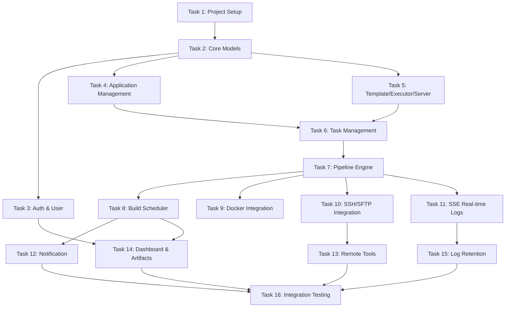

# Implementation Tasks

## Task Dependency Graph

## Tasks

### Task 1: Project Setup

- [ ] 1.1 Initialize Go module at `/Users/duhongx/df-build-system/backend/`
  - `go mod init df-build-server`
  - Add dependencies: gin, gorm, viper, zap, jwt, docker client, crypto/ssh, sftp, rapid
- [ ] 1.2 Create project directory structure
  - cmd/server/, internal/{handler,service,repository,model,pipeline,scheduler,docker,ssh,notification,middleware}/, pkg/{config,crypto,sse,response,logger}/
- [ ] 1.3 Implement configuration loading (pkg/config)
  - Viper-based config with YAML file + environment variable overrides
  - Create config/config.yaml with defaults
- [ ] 1.4 Implement logger initialization (pkg/logger)
  - Zap logger with configurable level and output
- [ ] 1.5 Implement database connection (internal/repository/db.go)
  - GORM PostgreSQL connection with connection pool settings
  - Auto-migration support
- [ ] 1.6 Implement unified response format (pkg/response)
  - Response, PageResponse, error response helpers
- [ ] 1.7 Create main.go entry point
  - Load config, init logger, connect DB, setup router, start server
- [ ] 1.8 Create Makefile with build/run/test/migrate targets
- [ ] 1.9 Create Dockerfile and docker-compose.yml

**Validates:** Infrastructure foundation for all requirements

---

### Task 2: Core Models & Migrations

- [ ] 2.1 Define User model (internal/model/user.go)
- [ ] 2.2 Define Application model with vue_role and app_code fields
- [ ] 2.3 Define Task model with foreign keys to application and executor
- [ ] 2.4 Define TaskServer join table model
- [ ] 2.5 Define Pipeline model with all metadata fields
- [ ] 2.6 Define PipelineStage model
- [ ] 2.7 Define StageLog model
- [ ] 2.8 Define Executor model
- [ ] 2.9 Define RemoteServer model with encrypted credential field
- [ ] 2.10 Define Template and TemplateDefault models
- [ ] 2.11 Define NotificationWebhook model
- [ ] 2.12 Define Artifact model
- [ ] 2.13 Define Settings model (key-value)
- [ ] 2.14 Create database migration that auto-migrates all models
- [ ] 2.15 Seed default settings (concurrency=5, timeout=1800, retention=30, etc.)
- [ ] 2.16 Seed default admin user (admin/123456)

**Validates:** Data model foundation for Requirements 1-25

---

### Task 3: Auth & User Module

- [ ] 3.1 Implement JWT middleware (internal/middleware/auth.go)
  - Token parsing, validation, user extraction from context
- [ ] 3.2 Implement CORS middleware
- [ ] 3.3 Implement Auth handler - Login (POST /api/auth/login)
  - Validate credentials, generate JWT, return token
- [ ] 3.4 Implement Auth handler - Logout (POST /api/auth/logout)
- [ ] 3.5 Implement Auth handler - GetProfile (GET /api/auth/profile)
- [ ] 3.6 Implement Auth handler - UpdateProfile (PUT /api/auth/profile)
- [ ] 3.7 Implement Auth handler - SendVerifyCode (POST /api/auth/send-code)
  - Email verification code generation and sending (mock for now)
- [ ] 3.8 Implement Auth handler - ChangePassword (POST /api/auth/change-password)
  - Verify code, hash new password with bcrypt, update
- [ ] 3.9 Implement User repository and service layers

**Validates:** Requirements 1, 2

---

### Task 4: Application Management

- [ ] 4.1 Implement Application repository (CRUD + search + filter)
- [ ] 4.2 Implement Application service
  - Validation: unique name, required fields, Vue role logic
  - Artifact name derivation based on app_type + vue_role + app_code
- [ ] 4.3 Implement Application handler
  - GET /api/applications (list with pagination, search, type filter)
  - GET /api/applications/:id
  - POST /api/applications (create with Vue role validation)
  - PUT /api/applications/:id
  - DELETE /api/applications/:id
- [ ] 4.4 Register routes in router

**Validates:** Requirements 3, 8

---

### Task 5: Template, Executor & Server Management

- [ ] 5.1 Implement Template repository and service
- [ ] 5.2 Implement Template handler (CRUD /api/templates)
  - Include template_defaults sub-resource
- [ ] 5.3 Implement Executor repository and service
- [ ] 5.4 Implement Executor handler (CRUD /api/executors)
- [ ] 5.5 Implement RemoteServer repository and service
  - Credential encryption on save, decryption on use
- [ ] 5.6 Implement RemoteServer handler (CRUD /api/servers + test connection)
- [ ] 5.7 Implement AES-256-GCM encryption utility (pkg/crypto/aes.go)
- [ ] 5.8 Implement Settings repository and service
- [ ] 5.9 Implement Settings handler (GET/PUT /api/settings)
- [ ] 5.10 Implement SSH test connection logic

**Validates:** Requirements 15, 16, 17, 18, 25

---

### Task 6: Task Management

- [ ] 6.1 Implement Task repository (CRUD + search + join with application/executor/servers)
- [ ] 6.2 Implement Task service
  - Validation: unique name, valid application_id, executor_id, server_ids
  - Update last_status/last_run_time after build completes
- [ ] 6.3 Implement Task handler
  - GET /api/tasks (list with last status, duration, execution time)
  - POST /api/tasks (create with multi-server association)
  - PUT /api/tasks/:id
  - DELETE /api/tasks/:id
- [ ] 6.4 Implement TaskServer many-to-many relationship handling

**Validates:** Requirements 4

---

### Task 7: Pipeline Execution Engine

- [ ] 7.1 Define StageRunner interface and StageResult struct
- [ ] 7.2 Implement Workspace manager (create, clean, paths)
- [ ] 7.3 Implement stage resolver (app_type → stage sequence)
  - Java: CHECK_REMOTE_DIR → CLEAN_WORKSPACE → GIT_CLONE → GRADLE_BUILD → UPLOAD_ARTIFACT → NOTIFY
  - Vue: CHECK_REMOTE_DIR → CLEAN_WORKSPACE → GIT_CLONE → YARN_BUILD → ZIP_PACKAGE → UPLOAD_ARTIFACT → NOTIFY
- [ ] 7.4 Implement Pipeline Engine orchestrator
  - Sequential stage execution with fail-fast
  - Context timeout handling
  - Status transitions (PENDING → RUNNING → SUCCESS/FAILED)
  - Stage status management (PENDING → RUNNING → SUCCESS/FAILED/SKIPPED)
- [ ] 7.5 Implement CheckRemoteDir stage (SSH: test -d && mkdir -p)
- [ ] 7.6 Implement CleanWorkspace stage (os.RemoveAll)
- [ ] 7.7 Implement GitClone stage (exec git clone -b branch repo dir)
- [ ] 7.8 Implement ZipPackage stage (exec zip -r name dist)
- [ ] 7.9 Implement UploadArtifact stage (SFTP upload to all target servers)
- [ ] 7.10 Implement Notify stage (call notification service)
- [ ] 7.11 Implement Pipeline service (create pipeline record, trigger execution)
- [ ] 7.12 Implement Pipeline handler
  - GET /api/pipelines (history list with filters)
  - GET /api/pipelines/:id (detail with stages)
  - POST /api/pipelines/:id/cancel
  - POST /api/pipelines/:id/retry
- [ ] 7.13 Implement Build Queue handler (GET /api/build-queue, DELETE /api/build-queue/:id)

**Validates:** Requirements 5, 6, 7, 8, 9, 10, 23, 24

---

### Task 8: Build Scheduler

- [ ] 8.1 Implement FIFO queue data structure
- [ ] 8.2 Implement slot manager (track running count vs limit)
- [ ] 8.3 Implement Scheduler with Enqueue/Cancel/SetConcurrency
  - Mutex-based concurrency control
  - Auto-dispatch when slot becomes available
- [ ] 8.4 Implement batch execution (create multiple pipelines, enqueue all)
- [ ] 8.5 Implement Execute handler (POST /api/tasks/:id/execute)
- [ ] 8.6 Implement BatchExecute handler (POST /api/tasks/batch-execute)
- [ ] 8.7 Wire scheduler startup in main.go (recover pending builds on restart)

**Validates:** Requirements 5, 6, 21

---

### Task 9: Docker Integration

- [ ] 9.1 Implement Docker client wrapper (internal/docker/client.go)
  - Connect to Docker engine via socket
  - Pull image, create container, start, wait, remove
- [ ] 9.2 Implement container options (image, command, mounts, CPU/memory limits)
- [ ] 9.3 Implement log streaming from container (attach stdout/stderr)
- [ ] 9.4 Implement GradleBuild stage using Docker client
- [ ] 9.5 Implement YarnBuild stage using Docker client
- [ ] 9.6 Handle container timeout (docker stop on context cancel)

**Validates:** Requirements 7.7, 7.8 (compilation in Docker)

---

### Task 10: SSH/SFTP Integration

- [ ] 10.1 Implement SSH client wrapper (internal/ssh/client.go)
  - Connect with password or private key (decrypt from DB)
  - Execute remote commands with stdout/stderr capture
- [ ] 10.2 Implement SFTP client wrapper (internal/ssh/sftp.go)
  - Upload file to remote path
  - Create remote directories
- [ ] 10.3 Integrate SSH client into CheckRemoteDir stage
- [ ] 10.4 Integrate SFTP client into UploadArtifact stage
- [ ] 10.5 Implement connection pooling/reuse for multiple uploads

**Validates:** Requirements 7 (upload stages), 13, 14, 18

---

### Task 11: Real-time Logs (SSE)

- [ ] 11.1 Implement SSE Hub (pkg/sse/hub.go)
  - Channel-per-pipeline, subscribe/unsubscribe/publish/close
- [ ] 11.2 Implement SSE HTTP handler (GET /api/pipelines/:id/logs/stream)
  - Set headers (Content-Type: text/event-stream, no-cache)
  - Subscribe to pipeline channel, write events until done
- [ ] 11.3 Integrate log capture into Pipeline Engine
  - Each stage runner publishes log lines to SSE Hub
  - Simultaneously write to stage_logs table
- [ ] 11.4 Implement stage log retrieval API (GET /api/pipelines/:id/stages/:stageId/logs)
  - Return archived logs from database
- [ ] 11.5 Handle client disconnect (unsubscribe from hub)

**Validates:** Requirements 11

---

### Task 12: Notification

- [ ] 12.1 Implement notification sender interface
- [ ] 12.2 Implement DingTalk webhook sender (internal/notification/dingtalk.go)
  - Format message with app name, branch, status, user, duration
  - HTTP POST to webhook URL
- [ ] 12.3 Implement WeCom webhook sender (internal/notification/wecom.go)
- [ ] 12.4 Implement notification trigger logic
  - After pipeline completes, check all enabled webhooks
  - Send based on notify_on_success / notify_on_failure flags
- [ ] 12.5 Implement Notification handler (CRUD + test)
- [ ] 12.6 Integrate notification into Notify stage

**Validates:** Requirements 19

---

### Task 13: Remote Tools

- [ ] 13.1 Implement Remote Sync service
  - SSH exec: rsync -avz --exclude=... source dest
  - Stream output via SSE
- [ ] 13.2 Implement Remote Sync handler (POST /api/remote/sync)
- [ ] 13.3 Implement Remote Sync SSE stream (GET /api/remote/sync/:id/stream)
- [ ] 13.4 Implement Remote Package service
  - SSH exec: tar -czvf archive -C parent dir
  - Stream output via SSE
- [ ] 13.5 Implement Remote Package handler (POST /api/remote/package)
- [ ] 13.6 Implement Remote Package SSE stream (GET /api/remote/package/:id/stream)

**Validates:** Requirements 13, 14

---

### Task 14: Dashboard & Artifacts

- [ ] 14.1 Implement Dashboard service
  - Count apps, today's builds, success/failed counts
  - Recent 6 builds query
- [ ] 14.2 Implement Dashboard handler (GET /api/dashboard/stats, /recent-builds)
- [ ] 14.3 Implement Artifact service
  - Create artifact record on successful build
  - List with pagination and search
- [ ] 14.4 Implement Artifact handler (GET /api/artifacts)
- [ ] 14.5 Integrate artifact creation into Pipeline Engine (after successful upload)

**Validates:** Requirements 12, 20

---

### Task 15: Log Retention & Cleanup

- [ ] 15.1 Implement log retention cron job
  - Daily schedule (e.g., 2:00 AM)
  - Delete stage_logs older than configured retention days
  - Retain pipeline metadata
- [ ] 15.2 Implement workspace cleanup in Pipeline Engine
  - After build completes, if setting enabled, remove workspace
- [ ] 15.3 Implement build timeout enforcement
  - Context timeout in Pipeline Engine
  - Kill Docker container / SSH session on timeout
- [ ] 15.4 Register cron jobs in main.go startup

**Validates:** Requirements 22, 23, 24

---

### Task 16: Integration & Property Testing

- [ ] 16.1 Write property test: Artifact Naming Derivation (P1)
- [ ] 16.2 Write property test: Application Validation Rules (P2)
- [ ] 16.3 Write property test: Scheduler Concurrency Invariant (P4)
- [ ] 16.4 Write property test: Scheduler FIFO Ordering (P5)
- [ ] 16.5 Write property test: Pipeline State Machine (P6)
- [ ] 16.6 Write property test: Stage Sequence Resolution (P7)
- [ ] 16.7 Write property test: Encryption Round-Trip (P8)
- [ ] 16.8 Write property test: Credential Masking (P9)
- [ ] 16.9 Write property test: Notification Conditional Sending (P10)
- [ ] 16.10 Write property test: Settings Validation (P11)
- [ ] 16.11 Write integration test: Full pipeline execution (Java app)
- [ ] 16.12 Write integration test: Full pipeline execution (Vue app)
- [ ] 16.13 Write integration test: Batch execution with concurrency
- [ ] 16.14 Write integration test: SSE log streaming

**Validates:** All correctness properties from design.md
